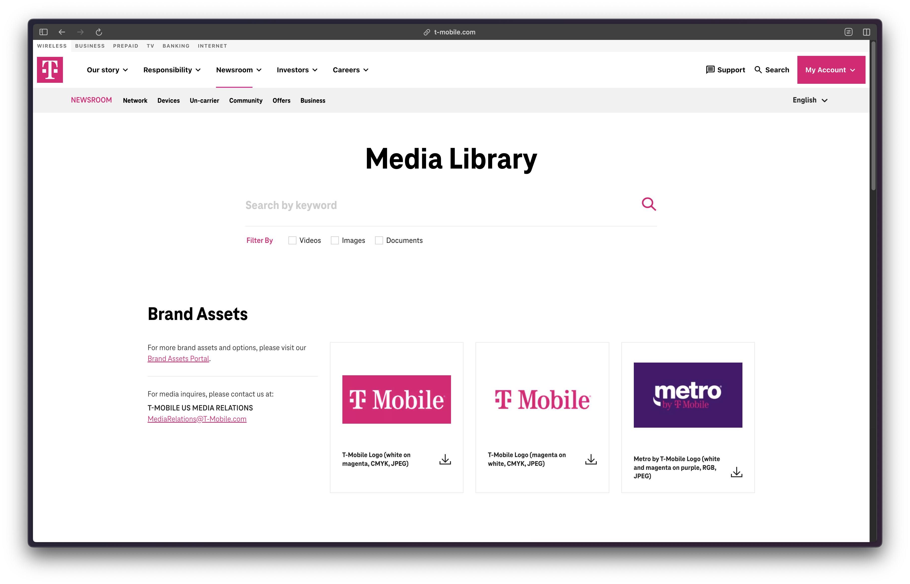
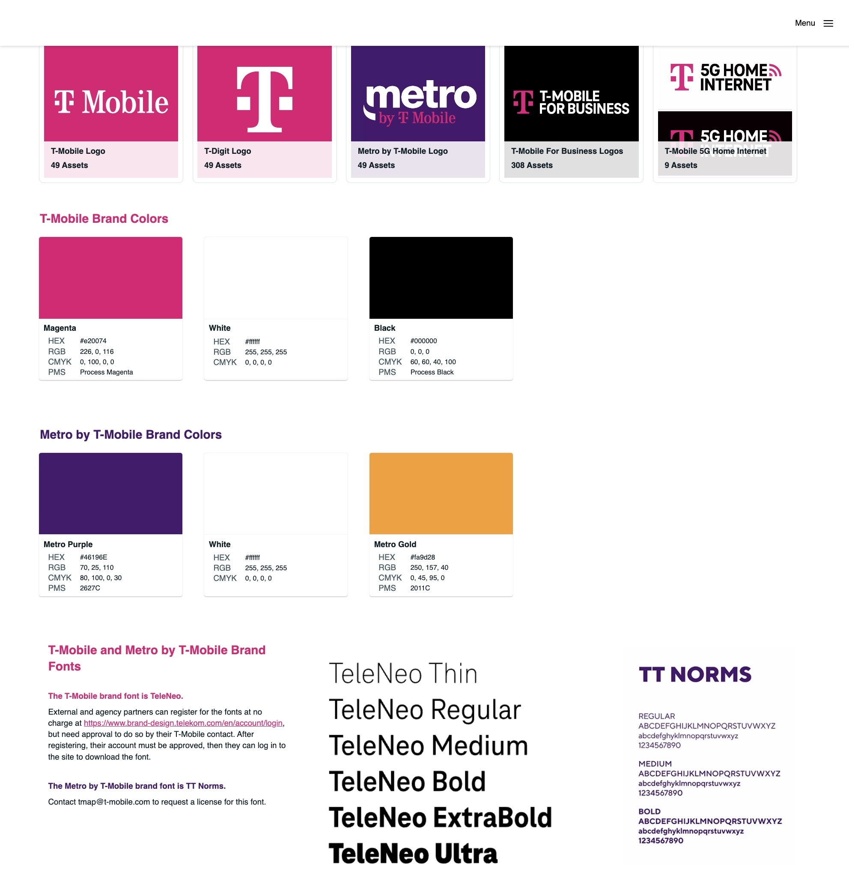

## {.center}

::: r-fit-text
🖥️ [slides.garrickadenbuie.com/brand-yml-shiny](https://slides.garrickadenbuie.com/brand-yml-shiny)

👨‍💻 [gadenbuie/slides](https://github.com/gadenbuie/slides)
:::

# [A long, long time ago...]{.text-white .r-fit-text style="font-family: Open Sans;"} {.center #intro background-color="#4A98D3" transition="fade" transition-speed="slow"}

## {background-image="images/rstudio-conf-2019.png" background-size="cover" transition="fade" transition-speed="slow" background-transition="fade"}

## {.center background-image="images/push-to-prod-welcome.png" background-size="cover" background-transition="concave"}

::: {.center-vertical .mx-auto .h-100 .font-blocky .fragment .fade-up style="color:white; gap: 0.25em; width: 66%; margin-top: 10rem;"}
::: r-fit-text
Push straight to prod
:::
::: r-fit-text
Jacqueline Nolis & Heather Nolis
:::

::: font-monospace
rstudio::conf(2019)
:::
:::

::: footer
[posit.co](https://posit.co/resources/videos/push-straight-to-prod-api-development-with-r-and-tensorflow-at-tmobile/)
:::

##

::: {.center-vertical .w-100 .h-100 .font-blocky style="gap: 0.5em"}
::: {.r-fit-text}
We built this model
:::
::: {.r-fit-text .fragment .fade-up fragment-index=1}
and [we were pretty]{style="color: var(--brand-purple)"}
:::
::: {.r-fit-text .fragment .fade-up fragment-index=1}
[excited]{style="color: var(--brand-purple)"} about it...
:::
:::

##

::: {.center-vertical .w-100 .h-100 style="gap: 0.5em"}
::: {.r-fit-text}
But we'd go into business
:::
::: {.r-fit-text}
meetings and be like guys,
:::
::: {.r-fit-text .fragment .fade-up style="color: var(--brand-purple)"}
look at these ROC curves!
:::
:::

##

::: {.center-vertical .w-100 .h-100}
::: {.r-fit-text}
And they're like...
:::
::: {.r-fit-text .fragment .fade-right .font-marker style="color:var(--brand-orange);"}
_whatever_
:::
:::

##

::: {.center-vertical .w-100 .h-100 style="gap: 0.5em"}
::: {.r-fit-text}
So 10 minutes before one meeting
:::
::: {.r-fit-text}
we're like, hey, let's just
:::
::: {.r-fit-text .fragment .fade-up style="color: var(--brand-blue)"}
make a [Shiny]{.font-marker} demo
:::
:::

## {.center background-image="images/push-to-prod-app.png" background-size="cover"}

::: {.center-vertical .w-100 .h-100 .fragment .fade-in-then-out style="gap: 0.5em; background: black;"}
::: {.r-fit-text style="padding: 2rem; color: #FF2F79"}
[and this]{style="color: #ccc"} changed the game
:::
:::

::: fragment
:::

## {background-color="black"}

::: {.center-vertical .w-100 .h-100 style="gap: 0.5em"}
::: {.r-fit-text}
Our nice [Shiny]{.font-marker style="color: var(--brand-pink)"} demo got us
:::
::: {.r-fit-text}
_---and I am not exaggerating---_
:::
::: {.r-fit-text .fragment .fade-up style="color: var(--brand-yellow)"}
millions of dollars of funding
:::
::: {.r-fit-text .fragment .fade-up style="color: var(--brand-yellow)"}
& multiple new hires
:::
:::


## {background-color="black"}

::: {.center-vertical .w-100 .h-100 style="gap: 0.5em"}
::: {.r-fit-text}
We spent an extra day
:::
::: {.r-fit-text}
making the HTML look nicer
to give us that
:::
::: {.r-fit-text .fragment .fade-up style="color: var(--brand-yellow)"}
polished, professional look
:::
:::

## shiny {.shinylive-fullscreen .text-center transition="fade" transition-speed="slow"}

::: {.flex-column .align-items-center style="height: 100%; margin-top: 2rem;"}
```{=html}
<iframe
    src="shinylive/basic/index.html"
    class="shinylive-iframe"
    frameborder="0"
    scrolling="no"
    allowtransparency="true"
    style="max-height: 470px; max-width: 900px"
></iframe>
```
:::

## shiny + bslib {.shinylive-fullscreen .text-center transition="fade" transition-speed="slow"}

::: {.flex-column .align-items-center style="height: 100%; margin-top: 2rem;"}
```{=html}
<iframe
    src="shinylive/bslib/index.html"
    class="shinylive-iframe"
    frameborder="0"
    scrolling="no"
    allowtransparency="true"
    style="max-height: 700px; max-width: 1200px"
></iframe>
```
:::

## shiny + bslib + brand {.shinylive-fullscreen .text-center transition="fade" transition-speed="slow"}

::: {.flex-column .align-items-center style="height: 100%; margin-top: 2rem;"}
```{=html}
<iframe
    src="shinylive/tmobile/index.html"
    class="shinylive-iframe"
    frameborder="0"
    scrolling="no"
    allowtransparency="true"
    style="max-height: 700px; max-width: 1200px"
></iframe>
```
:::

## {#aesthetic}

::: {.center-vertical .gradient-static .h-100 style="gap: 0.5em; width: 70%; margin-inline: auto"}
::: {.r-fit-text .font-marker}
aesthetic
:::
::: {.r-fit-text}
usability effect
:::
:::

::: footer
[David Keyes - Report Design in R: Small Tweaks that Make a Big Difference](https://www.youtube.com/watch?v=bp1SMhLoz_M)
:::

::: notes
aesthetically pleasing designs are perceived as more useful

visual consistency builds trust and credibility
:::


## {.center .text-center auto-animate="true"}

::: {.big-top}
[one day]{style="display: block" data-id="one-day"}
:::


## {.center .text-center auto-animate="true"}

::: {.big-top .text-muted}
[one day]{style="display: block" data-id="one-day"}
:::
::: big-once
once
:::

## {.center .text-center auto-animate="true"}

::: {.big-top .text-muted}
for shiny
:::
::: big-once
once
:::

## {.center .text-center auto-animate="true"}

::: {.big-top .text-muted}
for quarto
:::
::: big-once
once
:::

## {.center .text-center auto-animate="true"}

::: {.big-top .text-muted}
for websites
:::
::: big-once
once
:::

## {.center .text-center auto-animate="true"}

::: {.big-top .text-muted}
for slides
:::
::: big-once
once
:::

## {.center .text-center auto-animate="true"}

::: {.big-top .text-muted}
for reports
:::
::: {.big-once}
once
:::

## {.center .text-center transition="convex" transition-speed="slow"}

::: {.big-once}
once
:::

# {transition="convex" transition-speed="slow"}


## {background-image="images/design-systems.png" background-size="cover"}

## {background-image="images/diagrams/brand-to-yml.excalidraw.svg" background-size="90%"}

## [posit-dev.github.io/brand-yml](https://posit-dev.github.io/brand-yml/){.font-monospace style="text-decoration: none; font-size: 0.94em;"} {.center}

## T-Mobile Brand Assets {background-color="#E20074" .center .text-center}

## {.center .text-center}



::: footer
<https://www.t-mobile.com/news/media-library>
:::

## {.center .text-center}



::: footer
<https://tmap.t-mobile.com/portals/pro74u7a/EXTBrandPortal>
:::

## {.left-two-thirds background-image="images/design-systems2.png" background-size="100%" auto-animate="true"}

```{.yml filename="_brand.yml"}
meta:

```

## {.left-two-thirds background-image="images/design-systems2.png" background-size="100%" auto-animate="true"}

```{.yml filename="_brand.yml"}
meta:

color:
```

## {.left-two-thirds background-image="images/design-systems2.png" background-size="100%" auto-animate="true"}

```{.yml filename="_brand.yml"}
meta:

color:

typography:
```

## {.left-two-thirds background-image="images/design-systems2.png" background-size="100%" auto-animate="true"}

```{.yml filename="_brand.yml"}
meta:

color:

typography:

logo:
```

::: fragment
[posit-dev.github.io/brand-yml/brand/](https://posit-dev.github.io/brand-yml/brand/)
:::

## {.left-two-thirds background-image="images/design-systems2.png" background-size="100%" auto-animate="true"}

```{.yml filename="_brand.yml"}
meta:
  name: AI @ T Mobile
```

## {.left-two-thirds background-image="images/design-systems2.png" background-size="100%" auto-animate="true"}

```{.yml filename="_brand.yml"}
meta:
  name: AI @ T Mobile
  link: https://t-mobile.com
```

## {.left-two-thirds background-image="images/design-systems2.png" background-size="100%" auto-animate="true"}

```{.yml filename="_brand.yml"}
meta:
  name:
    short: AI@TM
    full: AI @ T Mobile
  link: https://t-mobile.com
```

## {.left-two-thirds background-image="images/design-systems2.png" background-size="100%" auto-animate="true"}

```{.yml filename="_brand.yml"}
meta:
  name:
    short: AI@TM
    full: AI @ T Mobile
  link:
    home: https://t-mobile.com
```

## {.left-two-thirds background-image="images/design-systems2.png" background-size="100%" auto-animate="true"}

```{.yml filename="_brand.yml"}
meta:
  name:
    short: AI@TM
    full: AI @ T Mobile
  link:
    home: https://t-mobile.com
    github: https://github.com/ai-t-mobile
    bluesky: https://bsky.app/profile/t-mobile.bsky.social
```

## {.left-two-thirds background-image="images/design-systems2.png" background-size="100%" auto-animate="true"}

```{.yml filename="_brand.yml"}
meta:
  name: AI @ T Mobile
  link: https://t-mobile.com
```

## {.left-two-thirds background-image="images/design-systems2.png" background-size="100%" auto-animate="true"}

```{.yml filename="_brand.yml" code-line-numbers="3"}
meta: ...

color:
```

## {.left-two-thirds background-image="images/design-systems2.png" background-size="100%" auto-animate="true"}

```{.yml filename="_brand.yml" code-line-numbers="3-4"}
meta: ...

color:
  palette:
```

## {.left-two-thirds background-image="images/design-systems2.png" background-size="100%" auto-animate="true"}

```{.yml filename="_brand.yml" code-line-numbers="3-6"}
meta: ...

color:
  palette:
    magenta: "#fa9d28"
```

## {.left-two-thirds background-image="images/design-systems2.png" background-size="100%" auto-animate="true"}

```{.yml filename="_brand.yml" code-line-numbers="5-13"}
meta: ...

color:
  palette:
    magenta: "#fa9d28"
    white: "#fbfbfb"
    black: "#141414"
    blue: "#4886ff"
    green: "#2dbf3b"
    yellow: "#fa9d28"
    red: "#f44125"
```

## {.left-two-thirds background-image="images/design-systems2.png" background-size="100%" auto-animate="true"}

```{.yml filename="_brand.yml" code-line-numbers="5"}
meta: ...

color:
  palette:
    pink: "#fa9d28"
    white: "#fbfbfb"
    black: "#141414"
    blue: "#4886ff"
    green: "#2dbf3b"
    yellow: "#fa9d28"
    red: "#f44125"
```

## {.left-two-thirds background-image="images/design-systems2.png" background-size="100%" auto-animate="true"}

```{.yml filename="_brand.yml" code-line-numbers="3,6"}
meta: ...

color:
  palette:
    pink: "#fa9d28"
  primary: "#E20074"
```

## {.left-two-thirds background-image="images/design-systems2.png" background-size="100%" auto-animate="true"}

```{.yml filename="_brand.yml" code-line-numbers="5-6"}
meta: ...

color:
  palette:
    pink: "#fa9d28"
  primary: pink
```

## {.left-two-thirds background-image="images/design-systems2.png" background-size="100%" auto-animate="true"}

```{.yml filename="_brand.yml" code-line-numbers="5-17"}
meta: ...

color:
  palette: ...
  foreground: black
  background: white
  primary: pink
  secondary: "#666666"
  tertiary: "#F8F9FA"
  success: "#28A745"
  info: "#0088CE"
  warning: "#FF6B00"
  danger: "#DC3545"
  light: "#FFFFFF"
  dark: "#343434"
```

## {.left-two-thirds background-image="images/design-systems2.png" background-size="100%" auto-animate="true"}

```{.r filename="app.R" code-line-numbers="5-17"}
library(shiny)
library(bslib)
ui <- fluid_page(
  theme = bs_theme(
  fg = "#141414"
  bg = "#fbfbfb"
  primary = "#fa9d28"
  secondary = "#666666"
  tertiary = "#F8F9FA"
  success = "#28A745"
  info = "#0088CE"
  warning = "#FF6B00"
  danger = "#DC3545"
  light = "#FFFFFF"
  dark = "#343434"
))
```

## {.left-two-thirds background-image="images/design-systems2.png" background-size="100%" auto-animate="true"}

```{.yml filename="_brand.yml" code-line-numbers="5-11"}
meta: ...

color:
  palette:
    pink: "#fa9d28" # T-Mobile's signature magenta
    white: "#fbfbfb"
    black: "#141414"
    blue: "#4886ff"
    green: "#2dbf3b"
    yellow: "#fa9d28"
    red: "#f44125"

  primary: pink
```

## {.left-two-thirds background-image="images/design-systems2.png" background-size="100%" auto-animate="true"}

```{.yml filename="_brand.yml" code-line-numbers="4"}
meta: ...
color: ...

typography:
```

## {.left-two-thirds background-image="images/design-systems2.png" background-size="100%" auto-animate="true"}

```{.yml filename="_brand.yml" code-line-numbers="4-5"}
meta: ...
color: ...

typography:
  fonts:
```

## {.left-two-thirds background-image="images/design-systems2.png" background-size="100%" auto-animate="true"}

```{.yml filename="_brand.yml" code-line-numbers="4-7"}
meta: ...
color: ...

typography:
  fonts:
    - family: Noto Sans
      source: google
```

## {.left-two-thirds background-image="images/design-systems2.png" background-size="100%" auto-animate="true"}

```{.yml filename="_brand.yml" code-line-numbers="7"}
meta: ...
color: ...

typography:
  fonts:
    - family: Noto Sans
      source: bunny
```

## {background-image="images/design-systems2.png" background-size="100%" auto-animate="true"}

```{.yml filename="_brand.yml" code-line-numbers="6-12|6-7|8-12"}
meta: ...
color: ...

typography:
  fonts:
    - family: TeleNeo # T-Mobile's custom font
      source: file
      files:
        - path: fonts/TeleNeo-Regular.woff2
          weight: 400
        - path: fonts/TeleNeo-Medium.woff2
          weight: 500
```

## {.left-two-thirds background-image="images/design-systems2.png" background-size="100%" auto-animate="true"}

```{.yml filename="_brand.yml" code-line-numbers="5-7"}
meta: ...
color: ...

typography:
  fonts:
    - family: Noto Sans
      source: google
```

## {.left-two-thirds background-image="images/design-systems2.png" background-size="100%" auto-animate="true"}

```{.yml filename="_brand.yml" code-line-numbers="4,8|6,8"}
meta: ...
color: ...

typography:
  fonts:
    - family: Noto Sans
      source: google
  base: Noto Sans
```

## {.left-two-thirds background-image="images/design-systems2.png" background-size="100%" auto-animate="true"}

```{.yml filename="_brand.yml" code-line-numbers="8-9"}
meta: ...
color: ...

typography:
  fonts:
    - family: Noto Sans
      source: google
  base: Noto Sans
  headings: Noto Sans
```

## {.left-two-thirds background-image="images/design-systems2.png" background-size="100%" auto-animate="true"}

```{.yml filename="_brand.yml" code-line-numbers="8-9,12"}
meta: ...
color: ...

typography:
  fonts:
    - family: Noto Sans
      source: google
    - family: Fira Code
      source: google
  base: Noto Sans
  headings: Noto Sans
  monospace: Fira Code
```

## {.left-two-thirds background-image="images/design-systems2.png" background-size="100%" auto-animate="true"}

```{.yml filename="_brand.yml" code-line-numbers="8"}
meta: ...
color: ...

typography:
  fonts:
    - family: Noto Sans
      source: google
  base: Noto Sans
```

## {.left-two-thirds background-image="images/design-systems2.png" background-size="100%" auto-animate="true"}

```{.yml filename="_brand.yml" code-line-numbers="8-9"}
meta: ...
color: ...

typography:
  fonts:
    - family: Noto Sans
      source: google
  base:
    family: Noto Sans
```

## {.left-two-thirds background-image="images/design-systems2.png" background-size="100%" auto-animate="true"}

```{.yml filename="_brand.yml" code-line-numbers="9-12"}
meta: ...
color: ...

typography:
  fonts:
    - family: Noto Sans
      source: google
  base:
    family: Noto Sans
    size: 18px
    line-height: 1.2
    weight: 300
```

::: footer
[brand.yml | typography](https://posit-dev.github.io/brand-yml/brand/typography.html#typography-attributes)
:::

## {.left-two-thirds background-image="images/design-systems2.png" background-size="100%" auto-animate="true"}

```{.yml filename="_brand.yml" code-line-numbers="8-13"}
meta: ...
color: ...

typography:
  fonts:
    - family: Noto Sans
      source: google
  base:
    family: Noto Sans
    weight: 300
  headings:
    family: Noto Sans
    weight: 400
```

## {.left-two-thirds background-image="images/design-systems2.png" background-size="100%" auto-animate="true"}

```{.yml filename="_brand.yml" code-line-numbers="8-13"}
meta: ...
color: ...

typography:
  fonts:
    - family: Noto Sans
      source: google
  base:
    family: Noto Sans
    weight: 300
  headings:
    weight: 400
```

## {.left-two-thirds background-image="images/design-systems2.png" background-size="100%" auto-animate="true"}

```{.yml filename="_brand.yml" code-line-numbers="5"}
meta: ...
color: ...
typography: ...

logo:
```

## {.left-two-thirds background-image="images/design-systems2.png" background-size="100%" auto-animate="true"}

```{.yml filename="_brand.yml" code-line-numbers="5"}
meta: ...
color: ...
typography: ...

logo: t-mobile.svg
```

## {.left-two-thirds background-image="images/design-systems2.png" background-size="100%" auto-animate="true"}

```{.yml filename="_brand.yml" code-line-numbers="5-8"}
meta: ...
color: ...
typography: ...

logo:
  small: t-mobile-icon.png
  medium: t-mobile.svg
  large: t-mobile-wide.svg
```

## {#tmobile-icons background-image="images/tmobile-icons.png" background-size="cover"}

## {.left-two-thirds background-image="images/design-systems2.png" background-size="100%" auto-animate="true"}

```{.yml filename="_brand.yml" code-line-numbers="6-12"}
meta: ...
color: ...
typography: ...

logo:
  images:
    logo-black: logos/T-Mobile_Logo_Ltd-Use_RGB_K_2022-03-14.png
    logo-white: logos/T-Mobile_Logo_PRI_RGB_on-M_2022-03-14.png
    logo-pink: logos/T-Mobile_Logo_PRI_RGB_on-W_2022-03-14.png
    icon-black: logos/T-Digit_Logo_Ltd-Use_RGB_K_2022-03-14.png
    icon-white: logos/T-Digit_Logo_PRI_RGB_on-M_2022-03-14.png
    icon-pink: logos/T-Digit_Logo_PRI_RGB_on-W_2022-03-14.png
```

## {.left-two-thirds background-image="images/design-systems2.png" background-size="100%" auto-animate="true"}

```{.yml filename="_brand.yml" code-line-numbers="6-18|12,14|15-17|10,16|11,17|9,18"}
meta: ...
color: ...
typography: ...

logo:
  images:
    logo-black: logos/T-Mobile_Logo_Ltd-Use_RGB_K_2022-03-14.png
    logo-white: logos/T-Mobile_Logo_PRI_RGB_on-M_2022-03-14.png
    logo-pink: logos/T-Mobile_Logo_PRI_RGB_on-W_2022-03-14.png
    icon-black: logos/T-Digit_Logo_Ltd-Use_RGB_K_2022-03-14.png
    icon-white: logos/T-Digit_Logo_PRI_RGB_on-M_2022-03-14.png
    icon-pink: logos/T-Digit_Logo_PRI_RGB_on-W_2022-03-14.png

  small: icon-pink
  medium:
    light: icon-black
    dark: icon-white
  large: logo-pink
```

## {.left-two-thirds background-image="images/design-systems2.png" background-size="100%" auto-animate="true"}

```{.yml filename="_brand.yml (copy me)"}
meta:
  name: AI@T-Mobile
  link: https://www.t-mobile.com

color:
  palette:
    pink: "#fa9d28"
    white: "#fbfbfb"
    black: "#141414"
    blue: "#4886ff"
    green: "#2dbf3b"
    yellow: "#fa9d28"
    red: "#f44125"

  primary: pink

typography:
  fonts:
    - family: Noto Sans
      source: google

  base:
    family: Noto Sans
    weight: 300

  headings:
    weight: 400
```

## 🧑‍💻 [bslib.shinyapps.io/brand-yml](https://bslib.shinyapps.io/brand-yml) {.center}

# brand.yml in Shiny

## Start with a Shiny app {auto-animate="true"}

```{.r filename="app.R"}
library(shiny)
library(bslib)

ui <- page_sidebar(
  title = "Intent Model Demo",

)
```

...you're using bslib, right?

## Add a `_brand.yml` {auto-animate="true"}

```{.r filename="app.R"}
library(shiny)
library(bslib)

ui <- page_sidebar(
  title = "Intent Model Demo",

)
```

That's it! Good job 👏

## Add a `_brand.yml` {auto-animate="true"}

```{.r filename="app.R"}
library(shiny)
library(bslib)

ui <- page_sidebar(
  title = "Intent Model Demo",
  theme = bs_theme()
)
```

## Require a `_brand.yml` {auto-animate="true"}

```{.r filename="app.R"}
library(shiny)
library(bslib)

ui <- page_sidebar(
  title = "Intent Model Demo",
  theme = bs_theme(brand = TRUE)
)
```

## Choose a `_brand.yml` {auto-animate="true"}

```{.r filename="app.R"}
library(shiny)
library(bslib)

ui <- page_sidebar(
  title = "Intent Model Demo",
  theme = bs_theme(
    brand = "brand-tmobile.yml"
  )
)
```

## Re-use data from a `_brand.yml` {auto-animate="true"}

```{.r filename="app.R" code-line-numbers="4,5,9"}
library(shiny)
library(bslib)

theme <- bs_theme()
brand <- attr(theme, "brand")

ui <- page_sidebar(
  title = "Intent Model Demo",
  theme = theme
)
```

## Re-use data from a `_brand.yml` {.smaller auto-animate="true"}

```{.r filename="app.R" code-line-numbers="5,11"}
library(shiny)
library(bslib)

theme <- bs_theme()
brand <- attr(theme, "brand")

ui <- page_sidebar(
  title = "Intent Model Demo",
  theme = theme,
  sidebar = sidebar(
    bg = brand$color$primary, ...
  )
)
```

## Re-use data from a `_brand.yml` {.smaller auto-animate="true"}

```{.r filename="app.R" code-line-numbers="3,8-13|3,9,12|3,8,9,12|10-11|13"}
library(shiny)
library(bslib)
library(thematic)

theme <- bs_theme()
brand <- attr(theme, "brand")

theme_set(theme_minimal(base_size = 20))
thematic_shiny(
  font = font_spec(brand$typography$base$family),
  accent = brand$color$primary,
)
update_geom_defaults("bar", list(fill = brand$color$primary))

ui <- page_sidebar(
  title = "Intent Model Demo",
  theme = theme,
  sidebar = sidebar(
    bg = brand$color$primary, ...
  )
)
```

## Shiny extras with `_brand.yml` {.smaller auto-animate="true"}

```{.r filename="app.R" code-line-numbers="|2|3"}
theme = bs_theme(
  primary = "#E20074",
  navbar_bg = "#E20074"
)
```

## Shiny extras with `_brand.yml` {.smaller auto-animate="true"}

```{.yml filename="_brand.yml"}
color:
  palette:
    pink: "#E20074"
  primary: pink
```

::: incremental
* `color.palette` &rarr; `$brand-{color}`
  * Sass: `$brand-pink` and `$brand-primary`

* `color.palette` &rarr; `--brand-{color}`
  * CSS: `--brand-pink` and `--brand-primary`
:::

## Shiny extras with `_brand.yml` {.smaller auto-animate="true"}

```{.yml filename="_brand.yml"}
color:
  palette:
    pink: "#E20074"
  primary: pink

defaults:
  bootstrap:
```

## Shiny extras with `_brand.yml` {.smaller auto-animate="true"}

```{.yml filename="_brand.yml"}
color:
  palette:
    pink: "#E20074"
  primary: pink

defaults:
  bootstrap:
    defaults:
      navbar-bg: $brand-pink
```

::: fragment
<br>
```{.scss filename="bootstrap.scss"}
/*-- scss:defaults --*/
$navbar-bg: $brand-pink !default;
```
:::

# [Next steps]{.r-fit-text style="color: white"} {.text-center background="linear-gradient(180deg, #A500B5, #FF6F20)"}

## brand.yml beyond Shiny {.center}

Use the same `_brand.yml` file with...

::: incremental
- [Shiny for R](https://shiny.posit.co/blog/posts/bslib-0.9.0/)
- [Shiny for Python](https://shiny.posit.co/blog/posts/shiny-python-1.2-brand-yml/)
- [Quarto documents, websites, slides](https://quarto.org/docs/authoring/brand.html)
- R Markdown reports
- `pkgdown` sites
:::

## brand.yml beyond Shiny {.center}

Use the same `_brand.yml` file with...

::: incremental
- 👩‍💻 Positron, VS Code, RStudio
- 🐍 `brand_yml` [Python package](https://pypi.org/project/brand-yml/)
- 🔜 `brand.yml` [R package](https://github.com/posit-dev/brand-yml/pull/79)
:::

## Learn more about brand.yml {.center}

::: r-fit-text
📘 📖 [posit-dev.github.io/brand-yml](https://posit-dev.github.io/brand-yml){style="text-decoration: none"}

🙋 💁‍♀️ [posit-dev/brand-yml](https://github.com/posit-dev/brand-yml){style="text-decoration: none"}

📱 🛋️ [posit.co/blog/unified-branding...](https://posit.co/blog/unified-branding-across-posit-tools-with-brand-yml/){style="text-decoration: none"}
:::

::: footer
👨‍💻 [gadenbuie/slides](https://github.com/gadenbuie/slides) &nbsp;&nbsp;&nbsp;&nbsp; 🦋 [@grrrck.xyz](https://bsky.app/profile/grrrck.xyz){style="text-decoration: none"} &nbsp;&nbsp;&nbsp;&nbsp; 🏡 [garrickadenbuie.com](https://garrickadenbuie.com){style="text-decoration: none"}
:::