# [👋 Hi, I'm Garrick]{.r-fit-text} {.center}

::: {.r-fit-text .fragment}
🆕 Joined Shiny in 2023
:::

:::  {.r-fit-text .fragment}
🎨 `{bslib}` with Carson Sievert
:::


## shiny + bslib

::: {.flex-row .align-items-center style="gap: 10vw"}

::: {style="width: 60%"}
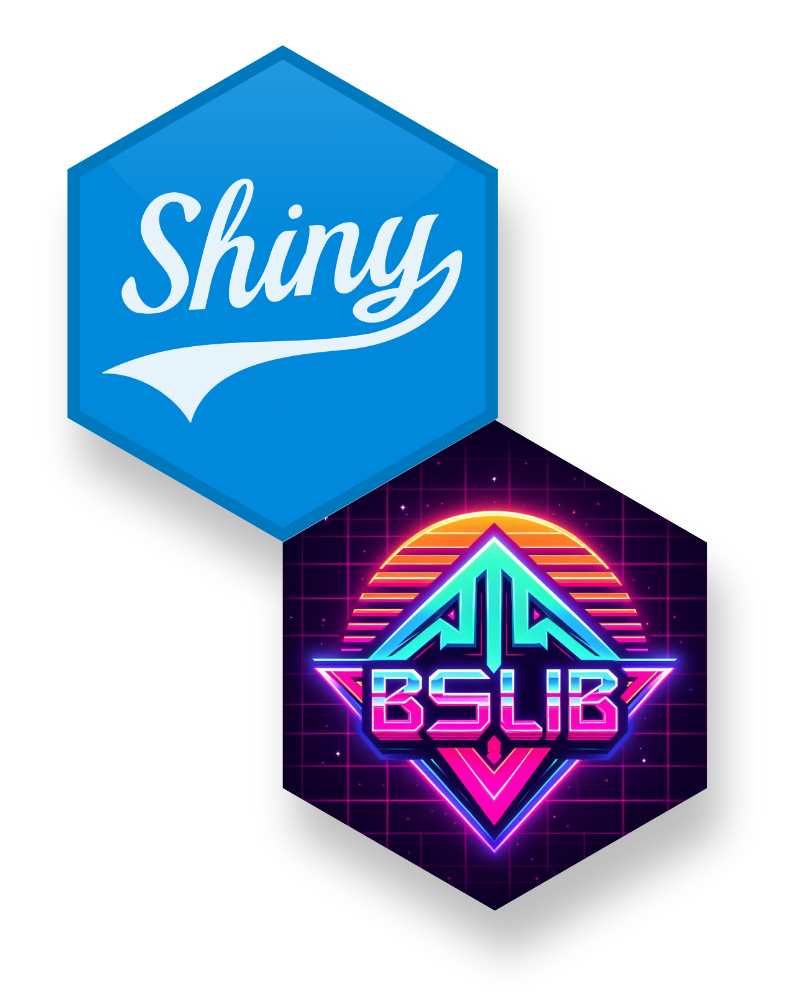
:::

::: {style="width: 40%"}
```r
library(shiny)
library(bslib)

ui <- fluidPage(
  theme = bs_theme(),
  # ...
)
```
:::

:::

::: notes
Drop in `bs_theme()` to get brand new Bootstrap themes
:::

## {.center background-image="images/bslib-theming.jpeg" background-position="center" background-size="cover"}

::: {.fragment .fade-in}
[rstudio.github.io/bslib]{.r-fit-text .text-white .bg-purple .p-3}
:::

## {background-image="images/cps-towards-next-gen.jpg" background-position="center" background-size="cover"}

::: notes
Speaking of Carson, last year he gave two great talks about bslib and the future of Shiny.
Check out "Towards the next generation of shiny ui".

Carson's talks focused on a lot of work we've done in bslib,
so let me quickly set the stage for you.
bslib started life as a theming package for Shiny...

Carson's talks were, essentially, an early preview and a big reveal
of our work to move have bslib do more than just theme your apps.
:::


# {.center}

[dash &middot; board]{.r-fit-text}
[| ˈdaSHˌbôrd |]{.r-fit-text .text-muted .font-monospace}

## 👨‍💻 Can you show me a dashboard made by humans? {.center}

::: {.fragment .fade-in style="font-size: var(--r-heading2-size);"}
🤖 ...
:::


## {background-image="images/ai-dashboard.png" background-size="contain" background-color="black"}

## {background-image="images/meme-is-this-a-dashboard.jpg" background-size="contain"}


## Is this a dashboard?

::: text-center
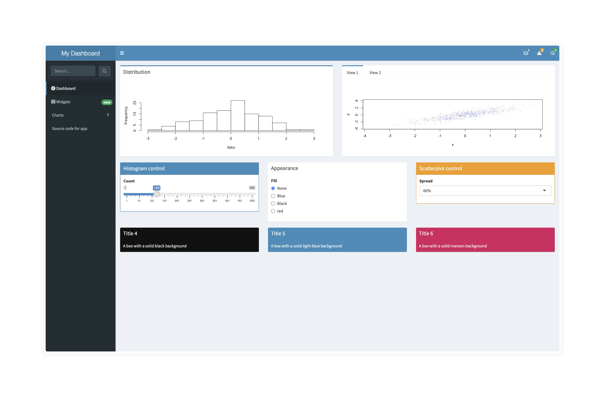{.nostretch width="1600"}
:::

## It's only a dashboard if it's from the `shinydashboard` package, otherwise it's a ✨ sparkling dashboard ✨ {.text-center}

::: text-center
{.nostretch width="1600"}
:::

## Is this a dashboard? {background-color="#FAFAFA"}

::: text-center
{.nostretch .mx-auto width="1200"}
:::

::: {.footer}
[<https://dribbble.com/shots/17581433-Mobile-Sales-Analytics-Figma-UI-Kit>]{style="font-size: 0.8em"}
:::

## Is this a dashboard?

::: text-center
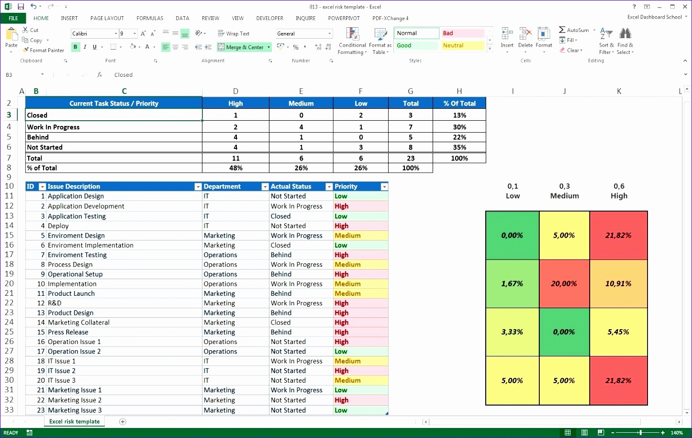{.nostretch width="1500"}
:::

## Is this a dashboard?

::: text-center
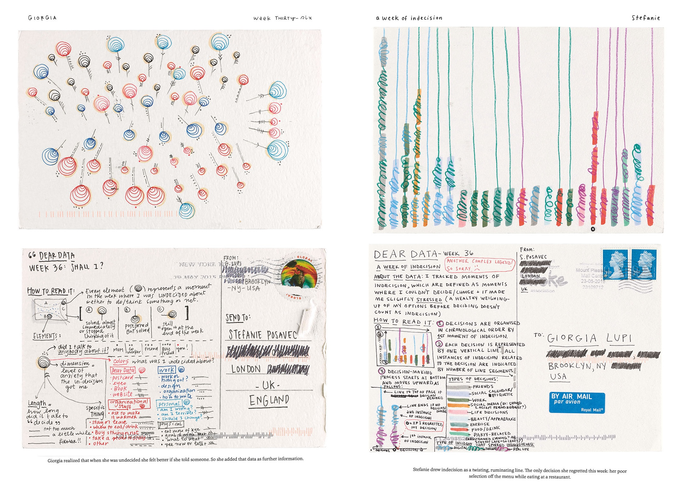{.nostretch width="1300"}
:::

::: footer
<https://www.dear-data.com/all>
:::

## 👨‍💻 How would a LinkedIn influencer define a dashboard? {.center}

::: {.fragment .fade-in style="font-size: var(--r-heading2-size);"}
🤖 ...
:::

::: {.r-fit-text .fragment .fade-in .text-muted .hl-purple}
A dashboard is a powerful tool for facilitating

**data-driven decision-making** and enhancing

business performance by **visualizing key metrics**

in a **user-friendly and accessible** format.
:::

# How to make a dashboard in 3 easy steps

## [How to make a dashboard in 3 easy steps]{.text-muted} {.center}

::: {.incremental .r-fit-text .hide-list-marker}
1. 👷‍♀️ Find, clean, assemble, explore, learn, re-clean some data

2. 📊 Summarize and present the data

3. 🧑‍🤝‍🧑 Share with your friends
:::

## [🙅 🙅‍♀️ 🙅‍♂️]{.r-fit-text} {.center}

## [How to make a dashboard in 3 easy steps]{.text-muted} {.center}

::: {.incremental .r-fit-text .hide-list-marker}
1. 🤔 Find someone with a question

2. 🦸 Use your data skills

3. 🚀 Share your data powers
:::

# {background-image="images/kenny-eliason-yDekvyZ52dU-unsplash.jpg" background-position="center" background-size="cover"}

::: {.footer .text-white}
[Photo by <a href="https://unsplash.com/@neonbrand?utm_content=creditCopyText">Kenny Eliason</a> on <a href="https://unsplash.com/photos/black-jeep-wrangler-yDekvyZ52dU?utm_content=creditCopyText">Unsplash</a>]{style="font-size: 1em"}
:::

## {background-image="images/mike-von-CzAvKe5wu7c-unsplash.jpg" background-position="center" background-size="cover"}

::: {.footer .text-white}
[Photo by <a href="https://unsplash.com/@thevoncomplex?utm_content=creditCopyText&utm_medium=referral&utm_source=unsplash">Mike Von</a> on <a href="https://unsplash.com/photos/a-gray-truck-parked-in-front-of-a-house-CzAvKe5wu7c?utm_content=creditCopyText&utm_medium=referral&utm_source=unsplash">Unsplash</a>]{style="font-size: 1em"}
:::

## {background-image="images/hill-country-camera-xR34oZzcEVw-unsplash.jpg" background-position="center" background-size="cover"}

::: {.footer .text-white}
[Photo by <a href="https://unsplash.com/@hillcountry_camera?utm_content=creditCopyText&utm_medium=referral&utm_source=unsplash">Hill Country Camera</a> on <a href="https://unsplash.com/photos/a-blue-truck-parked-inside-of-a-garage-xR34oZzcEVw?utm_content=creditCopyText&utm_medium=referral&utm_source=unsplash">Unsplash</a>
  ]{style="font-size: 1em"}
:::


## {background-image="images/jeep-weather-shinydashboard.png" background-position="center" background-size="cover"}

## {background-iframe="https://garrick-posit.shinyapps.io/jeep-weather/bslib/" background-interactive="true"}

## {background-image="images/hill-country-camera-xR34oZzcEVw-unsplash.jpg" background-position="center" background-size="cover"}

::: {.footer .text-white}
[Photo by <a href="https://unsplash.com/@hillcountry_camera?utm_content=creditCopyText&utm_medium=referral&utm_source=unsplash">Hill Country Camera</a> on <a href="https://unsplash.com/photos/a-blue-truck-parked-inside-of-a-garage-xR34oZzcEVw?utm_content=creditCopyText&utm_medium=referral&utm_source=unsplash">Unsplash</a>
  ]{style="font-size: 1em"}
:::

## {.center .text-center transition="fade"}

```{=html}
<div id="iphone-x" class="silver">
	<div class="wrap">
		<div class="marvel-device iphone-x"  style="box-shadow: var(--shadow-elevation-high)">
			<div class="notch">
				<div class="camera"></div>
				<div class="speaker"></div>
			</div>
			<div class="top-bar"></div>
			<div class="sleep"></div>
			<div class="bottom-bar"></div>
			<div class="volume"></div>
			<div class="overflow">
				<div class="shadow shadow--tr"></div>
				<div class="shadow shadow--tl"></div>
				<div class="shadow shadow--br"></div>
				<div class="shadow shadow--bl"></div>
			</div>
			<div class="inner-shadow"></div>
			<div class="screen">
        <iframe
          class="fragment"
          src="?show=title"
          frameborder="0"
          style="height: 100%; width: 100%; margin: 0; padding: 0; border: none; max-width: 100%; max-height: 100%;"
        ></iframe>
      </div>
		</div>
	</div>
</div>
```
# [`bslib` is the new `shinydashboard`]{style="font-size: 5.5vw"} {.center}

## [`bslib` is the new `shinydashboard`]{style="opacity: 0.66"} {.center}

::: {.incremental .r-fit-text}
1. Philosophical successor, not a drop in replacement

2. Data-driven **anything**, not just "dashboards"

3. Packed with transferrable experiences
:::

# Modern Dashboards with bslib

## {.center}

[`install.packages("shiny")`]{.r-fit-text}

## {.center}

[`install.packages(c("shiny", "bslib"))`]{.r-fit-text}


## shiny {transition="fade"}

```{.r}
library(shiny)


ui <- fluidPage(

)

server <- function(input, output, session) {

}

shinyApp(ui, server)
```

::: fragment
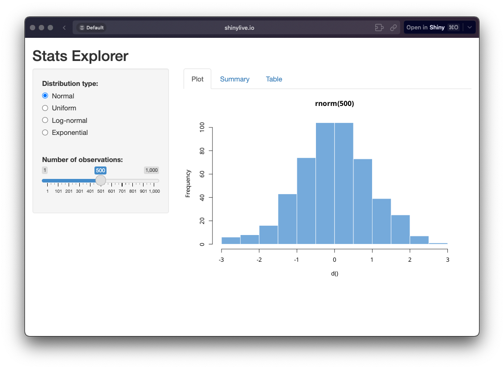{.absolute bottom=0 right=-75 width=1200}
:::

## shiny + bslib {transition="fade"}

```{.r}
library(shiny)
library(bslib)

ui <- page_fluid(

)

server <- function(input, output, session) {

}

shinyApp(ui, server)
```

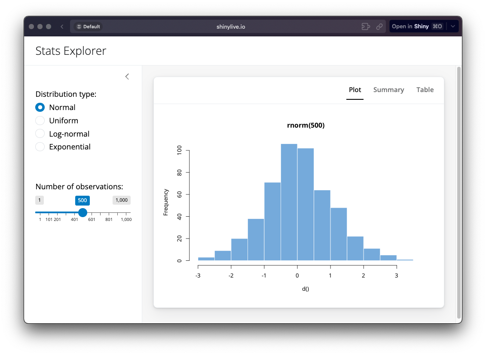{.absolute bottom=0 right=-75 width=1200}

## Choose your page {.center}

::: {.flex-row .align-items-center style="gap: 10vw"}
::: {.fragment style="width: 33%"}
{height=200}
`page_sidebar()`
:::

::: {.fragment style="width: 33%"}
{height=200}
`page_navbar()`
:::


::: {.fragment style="width: 33%"}
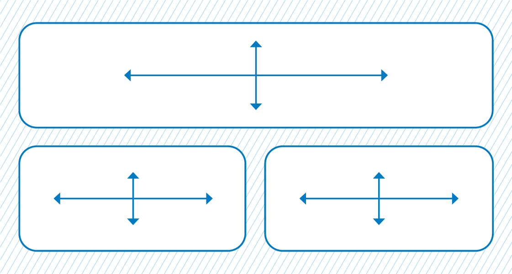{height=200}
`page_fillable()`
:::
:::

## Value boxes {.center}

::: {.flex-row .align-items-center style="gap: 10vw"}
::: {style="width: 40%"}
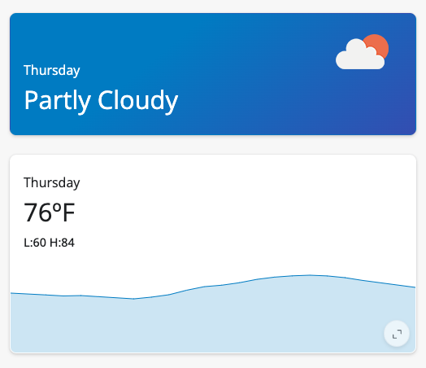{width="100%"}
:::

::: {style="width: 60%"}
```{.r}
value_box(
  title = textOutput("wday"),
  value = uiOutput("weather"),
  showcase = uiOutput("icon"),
  showcase_layout = "top right",
  theme = "bg-gradient-blue-purple"
)

value_box(
  title = textOutput("wday"),
  value = textOutput("avg_temp"),
  showcase = plotlyOutput("plot"),
  showcase_layout = "bottom",
  full_screen = TRUE
)
```
:::
:::


## {.center background-image="images/build-a-box.jpeg" background-position="center" background-size="cover"}

::: {.fragment .fade-in}
[bslib.shinyapps.io/build-a-box]{.r-fit-text .text-white .bg-purple .p-3}
:::

## Layout columns {.center}

{width="100%"}

::: {.flex-row .align-items-center style="gap: 10vw; justify-content: center"}
```{.r}
layout_columns(
  value_box(...),
  value_box(...),
)
```

::: text-muted
or
:::

```{.r}
layout_column_wrap(
  value_box(...),
  value_box(...),
)
```
:::

## Accordions {.center}

::: {.flex-row .align-items-center style="gap: 10vw"}
::: {style="width: 40%"}
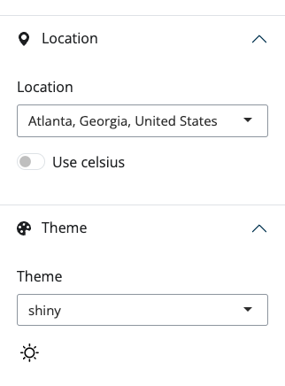{width="100%"}
:::

::: {style="width: 60%"}
```{.r}
accordion(
  accordion_panel(
    "Settings",
    ...
  ),
  accordion_panel(
    "Theme",
    ...
  )
)
```
:::
:::


## Tooltips & Popovers {.center}

::: {.flex-row .align-items-center style="gap: 10vw"}
::: {style="width: 550px; text-align: center"}
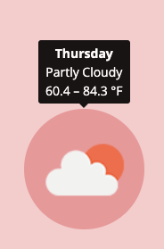{width=300}
:::

::: {style=""}
```{.r}
tooltip(
  trigger_element,
  strong("Thursday"),
  # ...
)
```
:::
:::

::: {.flex-row .align-items-center .fragment style="gap: 10vw"}
::: {style=""}
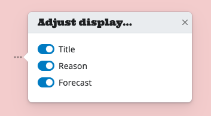{height=300}
:::

::: {style="text-align: center"}
```{.r}
popover(
  bsicons::bs_icon("three-dots"),
  title = "Adjust display..."
  input_switch("show_title", "Title"),
  # ...
)
```
:::
:::

## Task Button {.center}

::: {.flex-row .align-items-center style="gap: 10vw"}
::: {style="width: 40%"}
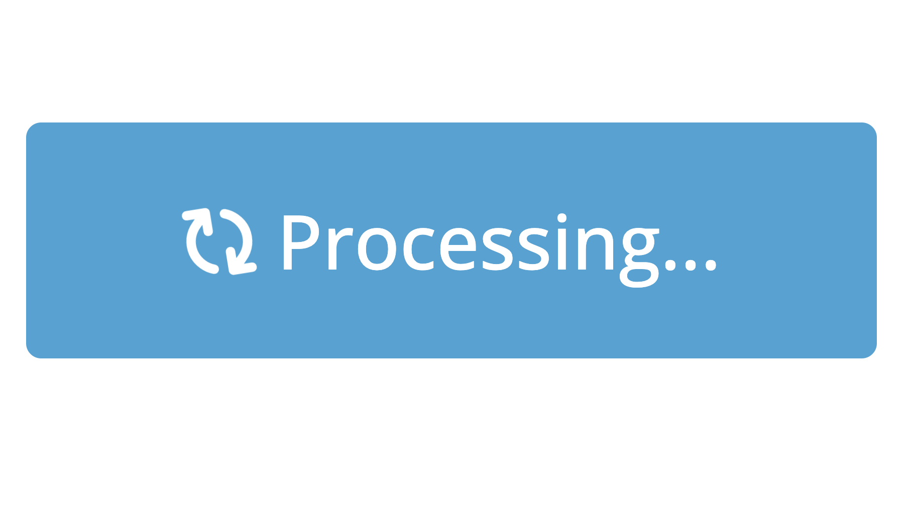{width="100%"}
:::

::: {style="width: 60%"}
```{.r}
# instead of this...
actionButton(
  "save_location",
  "Get Forecast"
)

# use this!
input_task_button(
  "save_location",
  "Get Forecast"
)
```
:::
:::

## Dark Mode! {.center}

::: {.flex-row .align-items-center style="gap: 10vw"}
::: {style="width: 40%; text-align: center"}
{height=200}

{height=200}
:::

::: {style="width: 60%"}
```{.r}
input_dark_mode()

input_dark_mode(id = "dark_mode")
#> input$dark_mode
```
:::
:::


## {.center background-image="images/bslib-dashboards.jpeg" background-position="center" background-size="cover"}

::: {.fragment .fade-in}
[rstudio.github.io/bslib]{.r-fit-text .text-white .bg-purple .p-3}
:::

# Thanks! {.center}

::: {.incremental .hide-list-marker style="font-size: 6vw;"}
* 🏡 [garrickadenbuie.com](https://www.garrickadenbuie.com)

* 🛝 [dub.sh/bslib-modern-dash](https://dub.sh/bslib-modern-dash)

* 🦣 [@grrrck@fosstodon.org](https://fosstodon.org/@grrrck)

* 👾 [pos.it/shiny-discord](https://pos.it/shiny-discord)
:::
