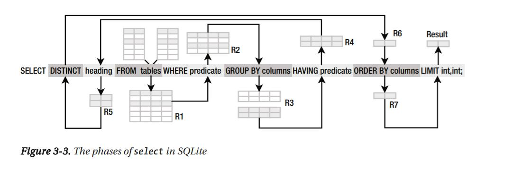
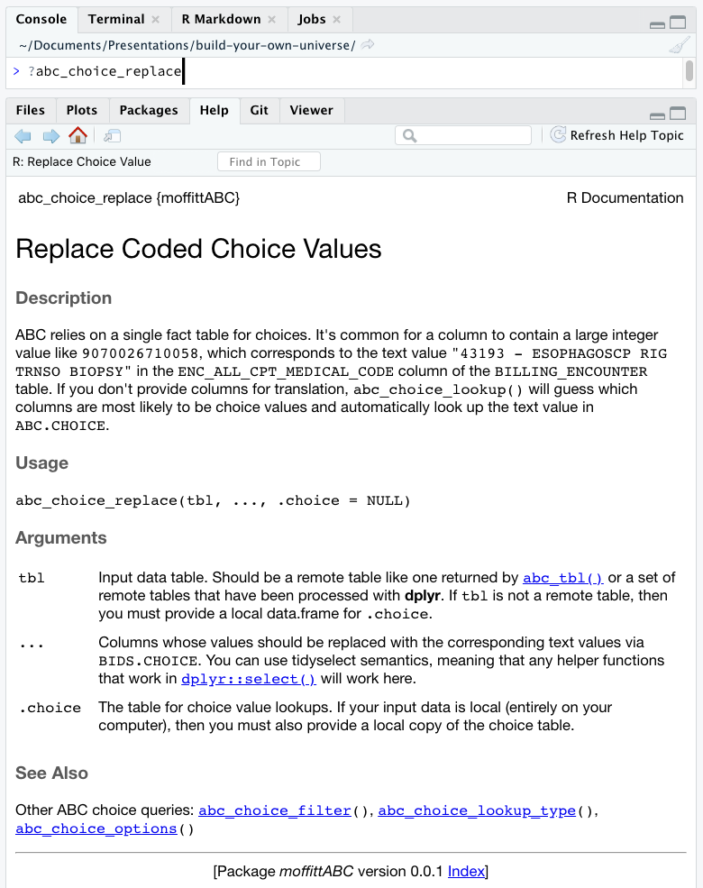
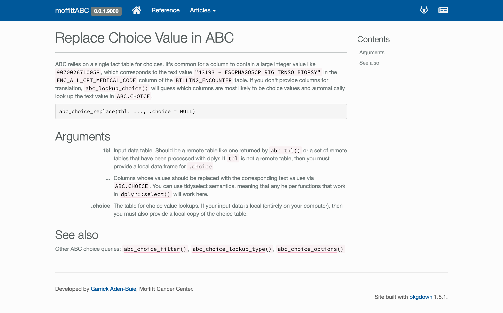
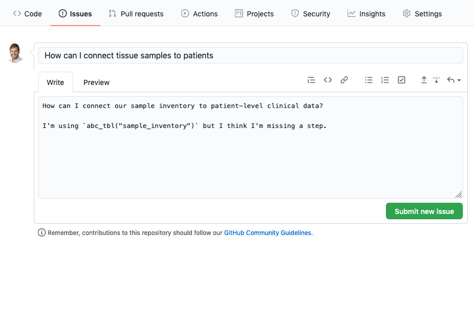
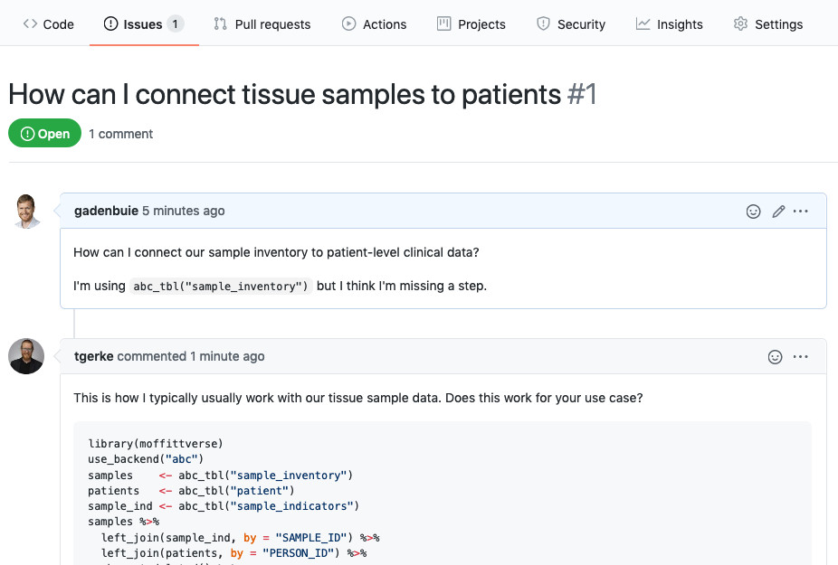
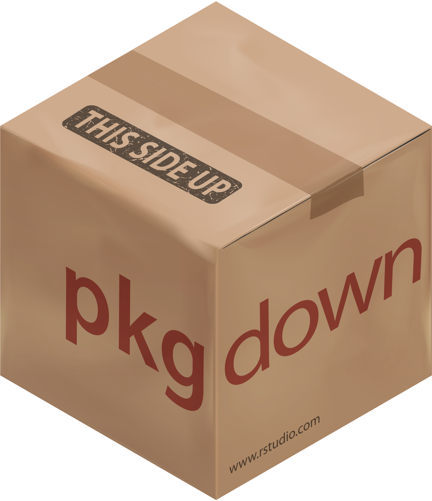

class: left middle blueprint2

```{r setup, echo=FALSE}
source("library.R")
source("setup.R")$value
```

.f4[
Scaling .b.blue[provisioning]<br>
by scaling .b.red[people]
]

.absolute.bottom-1.right-1[
[...continued from part 1](index.html)
]

???

Travis ends here...


---
class: left middle blueprint2

.f4[
Scaling .blue[provisioning]<br>
by scaling .red[people]<br>
... by scaling .b.green[access]
]


???

So as Travis talked about scaling provisioning  
by scaling systems of people,  
I'm going to talk about how we scale  
access to data systems  
through R packages

I'm going to start with an entirely hypothetical but familiar story...

---

class: center middle

.center.w-50[
.bubble.thought.vanishIn[
How do I connect our .blue.b[tissue sample] inventory to a .orange.b[patient's clinical] data?
]

.tr.f6[
&#x1F914;
]
]

???

It starts with a question

I want to connect **our tissue sample** inventory  
to **patient clinical** data.

It's not something I've done before,  
so I'm not quite sure how to access the samples table  
or how to link a sample to a patient  
but obviously it has to be possible.

So how do I get started?

---
class: no-border no-logo hide-count
background-image: url(figures/big-data-sensor-display.jpg)
background-size: cover
background-position: center right

???

If you believe the big data stock photos,  
I go to the self-service data wall  
and point at the numbers I want.

---

.ba.b--gray-4.br2.pv2.ph3.mv5.shadow-4.animated.fadeIn[
.b[Aden-Buie, Garrick]<br>
Question about Sample Availability Table

To: .gray-3[data-ops@acmemed.org]

***

.o-0[
How can I connect our sample inventory to patient-level clinical data?

I've heard you know the secret.

Thanks!

.gray-3[Garrick]
]
]

???

In reality, it probably starts with an email.  
Or many emails.

I start by reaching out to someone I know  
in data engineering  
who manages that particular data resource  
to see what they can tell me...

---

.ba.b--gray-4.br2.pv2.ph3.mv5.shadow-4[
.b[Aden-Buie, Garrick]<br>
Question about Sample Availability Table

To: .gray-3[data-ops@acmemed.org]

***

.css-typing[
How can I connect our sample inventory to patient-level clinical data?

I've heard you know the secret.

Thanks!

.gray-3[Garrick]
]
]


---

.w-90.ba.b--gray-4.br2.pv2.ph3.mv5.shadow-4.absolute.animated.lightSpeedOut[
.b[Aden-Buie, Garrick]<br>
Question about Sample Availability Table

To: .gray-3[data-ops@acmemed.org]

***

How can I connect our sample inventory to patient-level clinical data?

I've heard you know the secret.

Thanks!

.gray-3[Garrick]
]

.ba.b--gray-4.br2.pv2.ph3.mv5.shadow-4.relative.animated.bounceInDown.delay-2s[
.b[Friendly Data Ops Person]<br>
RE: Question about Sample Availability Table
<div class="w1 absolute right-2 gray-1" id="email-attachment">
<svg aria-hidden="true" focusable="false" data-prefix="far" data-icon="file-code" class="svg-inline--fa fa-file-code fa-w-12" role="img" xmlns="http://www.w3.org/2000/svg" viewBox="0 0 384 512"><path fill="currentColor" d="M149.9 349.1l-.2-.2-32.8-28.9 32.8-28.9c3.6-3.2 4-8.8.8-12.4l-.2-.2-17.4-18.6c-3.4-3.6-9-3.7-12.4-.4l-57.7 54.1c-3.7 3.5-3.7 9.4 0 12.8l57.7 54.1c1.6 1.5 3.8 2.4 6 2.4 2.4 0 4.8-1 6.4-2.8l17.4-18.6c3.3-3.5 3.1-9.1-.4-12.4zm220-251.2L286 14C277 5 264.8-.1 252.1-.1H48C21.5 0 0 21.5 0 48v416c0 26.5 21.5 48 48 48h288c26.5 0 48-21.5 48-48V131.9c0-12.7-5.1-25-14.1-34zM256 51.9l76.1 76.1H256zM336 464H48V48h160v104c0 13.3 10.7 24 24 24h104zM209.6 214c-4.7-1.4-9.5 1.3-10.9 6L144 408.1c-1.4 4.7 1.3 9.6 6 10.9l24.4 7.1c4.7 1.4 9.6-1.4 10.9-6L240 231.9c1.4-4.7-1.3-9.6-6-10.9zm24.5 76.9l.2.2 32.8 28.9-32.8 28.9c-3.6 3.2-4 8.8-.8 12.4l.2.2 17.4 18.6c3.3 3.5 8.9 3.7 12.4.4l57.7-54.1c3.7-3.5 3.7-9.4 0-12.8l-57.7-54.1c-3.5-3.3-9.1-3.2-12.4.4l-17.4 18.6c-3.3 3.5-3.1 9.1.4 12.4z"></path></svg>
</div>

To: .gray-3[Aden-Buie, Garrick]


***
Hey Garrick,

Here's the query we use to populate the table.

Good Luck!

.gray-3[Data Ops]
]

???

I fire off the email and a little while later I get a reply.

_read email_

And look, the email came with an attachment that I can open up.

---
name: sql-example

<pre id="sql-magnifier"><code class="sql hljs remark-code"><div class="remark-code-line"></div></code></pre>

.code-two-column.shadow-4.animated.zoomIn[
<div class="code code-window-title-bar ph2 mb0 pv1 mt5 small bg-gray-4 gray-1 center relative">
sample-inventory-patient.sql
<div class="code-window-circles">
  <span class="code-window-circle bg-gray-3 br-100 dib"></span><span class="code-window-circle bg-gray-3 br-100 dib"></span><span class="code-window-circle bg-gray-3 br-100 dib"></span>
</div>
</div>

```{sql example-query, eval=FALSE}
SELECT SA.PERSON_ID,SA.SAMPLE_ID,SA.SAMPLE_FAMILY_ID
,CH1.CHOICE_NAME AS COLLECTION_CONSORTIUM
,CH2.CHOICE_NAME AS CELFILE_RELATED
,CH3.CHOICE_NAME AS FROZEN_TUMOR_TISSUE
,CH4.CHOICE_NAME AS FROZEN_NORMAL_TISSUE
,CH5.CHOICE_NAME AS WHOLE_BLOOD
,CH6.CHOICE_NAME AS BUFFY_COAT
,CH7.CHOICE_NAME AS DNA_FROM_BLOOD
,CH8.CHOICE_NAME AS PLASMA
,CH9.CHOICE_NAME AS SERUM
,CH10.CHOICE_NAME AS PARAFFIN
,CH11.CHOICE_NAME AS URINE
,CH12.CHOICE_NAME AS RNA
,CH13.CHOICE_NAME AS MNC
,CH14.CHOICE_NAME AS DNA_FROM_SOLID
,CH15.CHOICE_NAME AS ADJACENT_NORMAL
,CH16.CHOICE_NAME AS LCS_PROTOCOL_BLOOD_AVA
,CH17.CHOICE_NAME AS SOO_CATEGORY
,CH36.CHOICE_NAME AS SOO_TISSUETYPE
,CH19.CHOICE_NAME AS HISTOLOGYCAP
,CH20.CHOICE_NAME AS PRIMARY_METASTATIC
,PI.MEDICAL_ID
,PI.PARTNER_ID
,CH21.Anatomic_Site AS SOO_ANATOMICSITE
,CH22.CHOICE_NAME AS GROSS_DIAGNOSIS
,CH23.CHOICE_NAME AS PRIMARY_SITE_PATIENT
,CH24.CHOICE_NAME AS HISTOLOGY_PATIENT
,CH25.CHOICE_NAME AS DERIVED_CATEGORY
,CH27.CHOICE_NAME AS DERIVED_TISSUETYPE
,SA.DERIVED_ANATOMIC_SITE AS DERIVED_ANATOMICSITE
,CH29.TISSUE_TYPE AS COL_SITE_TISSUE_TYPE
,SA.SPECIMEN_COLLECTION_DATE
,CH29.ANATOMIC_SITE AS COL_SITE_ANATOMIC
,CH30.CHOICE_NAME AS COL_SITE_CATEGORY
,SA.BIOBANKING_SUBJECT_ID AS SUBJECT_ID
,CH31.CHOICE_NAME AS WHOLE_EXOME
,CH32.CHOICE_NAME AS TARGET_EXOME
,CH33.CHOICE_NAME AS SAMPLE_TYPE
,SA.CURRENT_QUANTITY
,CH34.CHOICE_NAME AS PATH_DIAGNOSIS_PQC
,SA.SAMPLE_TO_CANR_CHAR_LINK
,CH35.CHOICE_NAME AS PROTOCOL
FROM ABC.SAMPLE SA
LEFT JOIN ABC.CHOICE CH1 ON SA.COLLECTION_FACILITY = CH1.CHOICE_ID
LEFT JOIN ABC.CHOICE CH2 ON SA.CELFILE_RELATED = CH2.CHOICE_ID
LEFT JOIN ABC.PATIENT PI ON SA.PERSON_ID = PI.PERSON_ID
LEFT JOIN ABC.SAMPLE_INDICATOR SI ON SA.SAMPLE_KEY = SI.SAMPLE_KEY
LEFT JOIN ABC.CHOICE CH3 ON SI.FROZ_TTISE_AVL_FOR_RIND = CH3.CHOICE_ID
LEFT JOIN ABC.CHOICE CH4 ON SI.FROZ_NORM_TISS_AVL_FOR_RIND = CH4.CHOICE_ID
LEFT JOIN ABC.CHOICE CH5 ON SI.WHLBAVLFDNAEXTNDR_INCL_PAXDNAS = CH5.CHOICE_ID
LEFT JOIN ABC.CHOICE CH6 ON SI.BUFY_COAT_AVL_FOR_RIND = CH6.CHOICE_ID
LEFT JOIN ABC.CHOICE CH7 ON SI.DNAEXTRF_BLOD_AVL_FOR_RIND = CH7.CHOICE_ID
LEFT JOIN ABC.CHOICE CH8 ON SI.PLA_AVL_FOR_RIND = CH8.CHOICE_ID
LEFT JOIN ABC.CHOICE CH9 ON SI.SER_AVL_FOR_RIND = CH9.CHOICE_ID
LEFT JOIN ABC.CHOICE CH10 ON SI.PARAF_BLK_AVL_FOR_RIND = CH10.CHOICE_ID
LEFT JOIN ABC.CHOICE CH11 ON SI.UNINE_AVL_FOR_RIND = CH11.CHOICE_ID
LEFT JOIN ABC.CHOICE CH12 ON SI.RNAEXTRF_SOLID_TTISE_FOR_RIND = CH12.CHOICE_ID
LEFT JOIN ABC.CHOICE CH13 ON SI.MONO_CELS_EXTR_FOR_RIND = CH13.CHOICE_ID
LEFT JOIN ABC.CHOICE CH14 ON SI.DNAEXTRF_SOLID_TTISE_FOR_RIND = CH14.CHOICE_ID
LEFT JOIN ABC.CHOICE CH15 ON SI.ADJA_NSLD_SAMPLE_AVL_INDR = CH15.CHOICE_ID
LEFT JOIN ABC.CHOICE CH16 ON SI.LCS_PROTC_BLOD_AVL_FOR_RIND = CH16.CHOICE_ID
LEFT JOIN ABC.CHOICE CH17 ON SA.DERIVED_SOO_CATEGORY = CH17.CHOICE_ID
LEFT JOIN ABC.CHOICE CH18 ON SA.DERIVED_SOO_TISSUE_TYPE = CH18.CHOICE_ID
LEFT JOIN ABC.CHOICE CH19 ON SA.HISTOLOGY_TYPE_CONFORMED_CAP = CH19.CHOICE_ID
LEFT JOIN ABC.CHOICE CH20 ON SA.DERIVED_PRIMARY_VS_METASTATIC = CH20.CHOICE_ID
LEFT JOIN ABC.TISSUE_TYPE CH21
  ON SUBSTR(SA.DERIVED_SOO_ANATOMIC_SITE,0,8) = CH21.TISSUE_TYPE_KEY
LEFT JOIN ABC.CHOICE CH22 ON SA.DERIVED_GROSS_DIAGNOSIS = CH22.CHOICE_ID
LEFT JOIN ABC.CHOICE CH23 ON SA.PRIMARY_SITE_PATIENT = CH23.CHOICE_ID
LEFT JOIN ABC.CHOICE CH24 ON SA.HISTOLOGY_PATIENT = CH24.CHOICE_ID
LEFT JOIN ABC.CHOICE CH25 ON SA.DERIVED_CATEGORY = CH25.CHOICE_ID
LEFT JOIN ABC.CHOICE CH26 ON SA.DERIVED_TISSUE_TYPE = CH26.CHOICE_ID
LEFT JOIN ABC.CHOICE CH27 ON SA.DERIVED_TISSUE_TYPE = CH27.CHOICE_ID
LEFT JOIN ABC.CHOICE CH28 ON SA.COLLECTION_SITE_TISSUE_TYPE = CH28.CHOICE_ID
LEFT JOIN ABC.TISSUE_TYPE CH29 ON SA.COLLECTION_SITE_ANATOMIC = CH29.TISSUE_TYPE_KEY
LEFT JOIN ABC.CHOICE CH30 ON SA.COLLECTION_SITE_CATEGORY = CH30.CHOICE_ID
LEFT JOIN ABC.CHOICE CH31 ON SI.WHL_EXOM_SEQ_AVL_INDR = CH31.CHOICE_ID
LEFT JOIN ABC.CHOICE CH32 ON SI.TAR_EXOM_SEQ_AVL_INDR = CH32.CHOICE_ID
LEFT JOIN ABC.CHOICE CH33 ON SA.SAMPLE_TYPE = CH33.CHOICE_ID
LEFT JOIN ABC.CHOICE CH34 ON SA.PATH_DIAGNOSIS_PQC = CH34.CHOICE_ID
LEFT JOIN ABC.CHOICE CH35 ON SA.PROTOCOL = CH35.CHOICE_ID
LEFT JOIN ABC.CHOICE CH36 ON SA.DERIVED_SOO_TISSUE_TYPE = CH36.CHOICE_ID
WHERE SA.ISDELETED = 0
```
]

???

And I'm immediately hit with a wall of sequel.

This query doesn't look pretty   
but in a couple hours I'll probably get the gist of it...

Somewhere in here, I'll find that this query uses...  
`sample`,  
`patient`  and
`sample_indicator` tables

and that all these lines   
are for translated coded columns into text labels

And hey, it's at least code, right?

Well... since we're emailing files around, sometimes you'll get a query like this
in a slightly different format...

---
class: no-logo no-border hide-count word-doc animated-slide slideInRight boingOutDown

<button id="sql-font-comic-sans" type="button"></button>
<button id="sql-font-size-up" type="button"></button>
<button id="sql-font-size-down" type="button"></button>

```{sql ref.label="example-query", eval=FALSE}
```

???

Like a word document!

Where the query doesn't really fit on screen or a page...

and formatting choices are... fluid

---
class: middle animated fadeIn delay-1s

.f6.b[SQL is .red[robot logic] &#x1F916;]



.footnote.tr[
[_Definitive Guide to SQLite_](https://www.apress.com/gp/book/9781430232254)
]

???

Putting aside the emailing and the word document format,
SQL queries aren't a great vehicle for knowledge transfer

They're good for precisely communicating data specifications
in the robot logic databases understand

but we have other ways of working with data
that have been specifically designed with humans in mind

---
class: middle

.f6.b[.code[dplyr] is .green[human logic] &#x1F917;]

<blockquote class = "ml0 lh-copy">
<span style="font-size:1.6em">Programs must be <span class="focus-ul" tabindex="1">written for people to read</span>, and only <span class="focus-ul" tabindex="1">incidentally for machines</span> to execute.</span>

<br><br><cite>Harold Abelson, Structure and Interpretation of Computer Programs</cite>
</blockquote>

???

for example, dplyr

whose API is very intentionally designed
in line with the philopsophy that code is
written for people to read
and only incidentally for machines to execute

Which reminds me of a great quote from Jenny Bryan...

---
class: middle

<div class="f4 blue lh-copy">
Of course someone<br>
has to write for loops.<br>
It doesn't have to be you.
</div>

<div class="f6 red lh-copy">— Jenny Bryan</div>

---
class: middle animated-slide fadeIn


<div class="f4 blue lh-copy">
Of course someone<br>
has to write <del>for loops</del>.<br>
It doesn't have to be you.
</div>

<div class="absolute red f1" style="top: 160px;right: 340px;transform: rotate(-36deg);">↝</div>
<div class="absolute f3 red" style="top: 130px;right: 170px;transform: rotate(-7deg);">SQL</div>

<div class="f6 red lh-copy">— Garrick Aden-Buie</div>

???

Let's take a look at what this query might look like
in an alternate universe...

---
name: moffittverse-code-example
class: animated-slide fadeIn

.remark-code.code-example.pa2[
.purple[library](moffittverse)<br><br>
use_backend(.green["abc"])<br><br>
samples&nbsp;&nbsp;&nbsp;&nbsp;&lt;-&nbsp;abc_tbl(.green["sample_inventory"])<br>
patients&nbsp;&nbsp;&nbsp;&lt;-&nbsp;abc_tbl(.green["patient"])<br>
sample_ind&nbsp;&lt;-&nbsp;abc_tbl(.green["sample_indicators"])<br><br>
samples&nbsp;%&gt;%&nbsp;<br>
&nbsp;&nbsp;left_join(sample_ind,&nbsp;by&nbsp;=&nbsp;.green["SAMPLE_ID"])&nbsp;%&gt;%&nbsp;<br>
&nbsp;&nbsp;left_join(patients,&nbsp;by&nbsp;=&nbsp;.green["PERSON_ID"])&nbsp;%&gt;%&nbsp;<br>
&nbsp;&nbsp;abc_not_deleted()&nbsp;%&gt;%&nbsp;<br>
&nbsp;&nbsp;abc_choice_replace()
]

???

Here's the same query,
rewritten using a blend of `dplyr`
and custom functions that support our particular setup

---


.remark-code.code-example.pa2.gray-4[
library(moffittverse)<br><br>
use_backend("abc")<br><br>
samples&nbsp;&nbsp;&nbsp;&nbsp;&lt;-&nbsp;abc_tbl("sample_inventory")<br>
patients&nbsp;&nbsp;&nbsp;&lt;-&nbsp;abc_tbl("patient")<br>
sample_ind&nbsp;&lt;-&nbsp;abc_tbl("sample_indicators")<br><br>
samples&nbsp;%&gt;%&nbsp;<br>
&nbsp;&nbsp;left_join(sample_ind,&nbsp;by&nbsp;=&nbsp;"SAMPLE_ID")&nbsp;%&gt;%&nbsp;<br>
&nbsp;&nbsp;left_join(patients,&nbsp;by&nbsp;=&nbsp;"PERSON_ID")&nbsp;%&gt;%&nbsp;<br>
&nbsp;&nbsp;abc_not_deleted()&nbsp;%&gt;%&nbsp;<br>
&nbsp;&nbsp;abc_choice_replace())
]

???

Let's walk through what this code represents step by setup

---
class: animated-slide fadeIn

.remark-code.code-example.pa2.gray-4[
.leader-end-1.gray-1[library(moffittverse)]<br><br>
use_backend("abc")<br><br>
samples&nbsp;&nbsp;&nbsp;&nbsp;&lt;-&nbsp;abc_tbl("sample_inventory")<br>
patients&nbsp;&nbsp;&nbsp;&lt;-&nbsp;abc_tbl("patient")<br>
sample_ind&nbsp;&lt;-&nbsp;abc_tbl("sample_indicators")<br><br>
samples&nbsp;%&gt;%&nbsp;<br>
&nbsp;&nbsp;left_join(sample_ind,&nbsp;by&nbsp;=&nbsp;"SAMPLE_ID")&nbsp;%&gt;%&nbsp;<br>
&nbsp;&nbsp;left_join(patients,&nbsp;by&nbsp;=&nbsp;"PERSON_ID")&nbsp;%&gt;%&nbsp;<br>
&nbsp;&nbsp;abc_not_deleted()&nbsp;%&gt;%&nbsp;<br>
&nbsp;&nbsp;abc_choice_replace()
]

<div class="leader-start-1 animated-slide fadeIn">Our universe</div>

???

We call our universe _moffittverse_.

Very much inspired by the _tidyverse_,
where a single `library(moffittverse)`
loads a common set of packages
that we use for nearly every data request

---

.remark-code.code-example.pa2.gray-4[
.leader-end-1.gray-1[library(moffittverse)]<br>
.expand-in.h-250px.gray-1.bg-gray-8.ph3.pv1[
── .b[Attaching packages] ──────── moffittverse 0.0.1 ──<br>
.green[✓] tibble&nbsp;&nbsp;&nbsp;&nbsp; 3.0.1&nbsp;&nbsp;&nbsp;&nbsp;&nbsp;&nbsp;&nbsp;&nbsp;&nbsp;&nbsp;.green[✓] purrr&nbsp;&nbsp;&nbsp;&nbsp;&nbsp;&nbsp;0.3.4&nbsp;&nbsp;&nbsp;&nbsp; <br>
.green[✓] tidyr&nbsp;&nbsp;&nbsp;&nbsp;&nbsp;&nbsp;1.1.0&nbsp;&nbsp;&nbsp;&nbsp;&nbsp;&nbsp;&nbsp;&nbsp;&nbsp;&nbsp;.green[✓] dplyr&nbsp;&nbsp;&nbsp;&nbsp;&nbsp;&nbsp;1.0.0&nbsp;&nbsp;&nbsp;&nbsp; <br>
.green[✓] fs&nbsp;&nbsp;&nbsp;&nbsp;&nbsp;&nbsp;&nbsp;&nbsp; 1.5.0&nbsp;&nbsp;&nbsp;&nbsp;&nbsp;&nbsp;&nbsp;&nbsp;&nbsp;&nbsp;.green[✓] stringr&nbsp;&nbsp;&nbsp;&nbsp;1.4.0&nbsp;&nbsp;&nbsp;&nbsp; <br>
.green[✓] glue&nbsp;&nbsp;&nbsp;&nbsp;&nbsp;&nbsp; 1.4.1&nbsp;&nbsp;&nbsp;&nbsp;&nbsp;&nbsp;&nbsp;&nbsp;&nbsp;&nbsp;.green[✓] forcats&nbsp;&nbsp;&nbsp;&nbsp;0.5.0&nbsp;&nbsp;&nbsp;&nbsp; <br>
.green[✓] readr&nbsp;&nbsp;&nbsp;&nbsp;&nbsp;&nbsp;1.3.1&nbsp;&nbsp;&nbsp;&nbsp;&nbsp;&nbsp;&nbsp;&nbsp;&nbsp;&nbsp;.green[✓] lubridate&nbsp;&nbsp;1.7.9&nbsp;&nbsp;&nbsp;&nbsp; <br>
.green[✓] readxl&nbsp;&nbsp;&nbsp;&nbsp; 1.3.1&nbsp;&nbsp;&nbsp;&nbsp;&nbsp;&nbsp;&nbsp;&nbsp;&nbsp;&nbsp;.green[✓] <span class="focus-ul" tabindex="1">moffittCDS 0.1.0</span>
]<br><br>
use_backend("abc")<br><br>
samples&nbsp;&nbsp;&nbsp;&nbsp;&lt;-&nbsp;abc_tbl("sample_inventory")<br>
patients&nbsp;&nbsp;&nbsp;&lt;-&nbsp;abc_tbl("patient")<br>
sample_ind&nbsp;&lt;-&nbsp;abc_tbl("sample_indicators")<br><br>
samples&nbsp;%&gt;%&nbsp;<br>
&nbsp;&nbsp;left_join(sample_ind,&nbsp;by&nbsp;=&nbsp;"SAMPLE_ID")&nbsp;%&gt;%&nbsp;<br>
&nbsp;&nbsp;left_join(patients,&nbsp;by&nbsp;=&nbsp;"PERSON_ID")&nbsp;%&gt;%&nbsp;<br>
&nbsp;&nbsp;abc_not_deleted()&nbsp;%&gt;%&nbsp;<br>
&nbsp;&nbsp;abc_choice_replace()
]

<div class="leader-start-1">Our universe</div>

???

Most of the packages are from the tidyverse,

but we also include our own supporting package:   
&#x25B6;&#xFE0F; `moffittCDS`   
specifically tailored to my team's workflow.

This creates a common starting point
for everyone on the team.

---
class: animated-slide fadeIn

.remark-code.code-example.pa2.gray-4[
library(moffittverse)<br><br>
.leader-end-2.gray-1[use_backend("abc")]<br><br>
samples&nbsp;&nbsp;&nbsp;&nbsp;&lt;-&nbsp;abc_tbl("sample_inventory")<br>
patients&nbsp;&nbsp;&nbsp;&lt;-&nbsp;abc_tbl("patient")<br>
sample_ind&nbsp;&lt;-&nbsp;abc_tbl("sample_indicators")<br><br>
samples&nbsp;%&gt;%&nbsp;<br>
&nbsp;&nbsp;left_join(sample_ind,&nbsp;by&nbsp;=&nbsp;"SAMPLE_ID")&nbsp;%&gt;%&nbsp;<br>
&nbsp;&nbsp;left_join(patients,&nbsp;by&nbsp;=&nbsp;"PERSON_ID")&nbsp;%&gt;%&nbsp;<br>
&nbsp;&nbsp;abc_not_deleted()&nbsp;%&gt;%&nbsp;<br>
&nbsp;&nbsp;abc_choice_replace()
]

<div class="leader-start-2 animated-slide fadeIn">Standardized,<br> managed connections</div>

???

It also gives us a formal "on ramp"  
to install and set up database dependencies  
that we can leverage in specific packages  
to interface with our many back-end systems  

This makes connecting to a specific databse straightforward...

you call _use backend_   
with the name of the database or server  
that you need to connect to

---
class: animated-slide fadeIn

.remark-code.code-example.pa2.gray-4[
library(moffittverse)<br><br>
.leader-end-2.gray-1[use_backend("abc")]<br><br>
.expand-in.h-150px.gray-1.bg-gray-8.ph3[
.purple[library](DBI)<br>
.purple[library](dbplyr)<br>
.purple[library](<span class="focus-ul" tabindex="1">moffittABC</span>)<br>
<span class="focus-ul" tabindex="1">con <- dbConnect(odbc::odbc(), uid = .green["fiddly"], pwd = .green["details"], ...)</span>
]<br>
samples&nbsp;&nbsp;&nbsp;&nbsp;&lt;-&nbsp;abc_tbl("sample_inventory")<br>
patients&nbsp;&nbsp;&nbsp;&lt;-&nbsp;abc_tbl("patient")<br>
sample_ind&nbsp;&lt;-&nbsp;abc_tbl("sample_indicators")<br><br>
samples&nbsp;%&gt;%&nbsp;<br>
&nbsp;&nbsp;left_join(sample_ind,&nbsp;by&nbsp;=&nbsp;"SAMPLE_ID")&nbsp;%&gt;%&nbsp;<br>
&nbsp;&nbsp;left_join(patients,&nbsp;by&nbsp;=&nbsp;"PERSON_ID")&nbsp;%&gt;%&nbsp;<br>
&nbsp;&nbsp;abc_not_deleted()&nbsp;%&gt;%&nbsp;<br>
&nbsp;&nbsp;abc_choice_replace()
]

<div class="leader-start-2">Standardized,<br> managed connections</div>

???

and behind the scenes `use_backend()`  
loads additional packages like `dbplyr`  
as well as a package specifically for this back-end,  
&#x25B6;&#xFE0F; `moffittABC`

Each backend package has two primary goals,  
the first is to simplify access.  

So by default, moffittABC will not only  
&#x25B6;&#xFE0F; remember the incancantations required to connect  
to the ABC database  

but it will actually manage the connection for users internally

---
class: animated-slide fadeIn


.remark-code.code-example.pa2.gray-4[
library(moffittverse)<br><br>
use_backend("abc")<br><br>
.leader-end-3.gray-1[.onClickStyle.red.bg-red-8[samples]&nbsp;&nbsp;&nbsp;&nbsp;&lt;-&nbsp;<span class = "reveal-focus" tabindex="1"><span class="reveal-shown">abc_tbl("sample_inventory")</span><span class="reveal-other">tbl(con, dbplyr::in_schema("ABC", "SAMPLE_INVENTORY"))</span>]<br>
.gray-1[.onClickStyle.purple.bg-purple-8[patients]&nbsp;&nbsp;&nbsp;&lt;-&nbsp;abc_tbl("patient")]<br>
.gray-1[.onClickStyle.yellow-1.bg-yellow-8[sample_ind]&nbsp;&lt;-&nbsp;abc_tbl("sample_indicators")]<br><br>
samples&nbsp;%&gt;%&nbsp;<br>
&nbsp;&nbsp;left_join(sample_ind,&nbsp;by&nbsp;=&nbsp;"SAMPLE_ID")&nbsp;%&gt;%&nbsp;<br>
&nbsp;&nbsp;left_join(patients,&nbsp;by&nbsp;=&nbsp;"PERSON_ID")&nbsp;%&gt;%&nbsp;<br>
&nbsp;&nbsp;abc_not_deleted()&nbsp;%&gt;%&nbsp;<br>
&nbsp;&nbsp;abc_choice_replace()
]

<div class="leader-start-3 animated-slide fadeIn">Easy schema/table access</div>

???

and in addition it also provides easy access to tables  
with functions like `abc_tbl()`.

Here we use the `abc_tbl()` function to  
&#x25B6;&#xFE0F; connect to a table in our database  
that not at all coincidentally is a table in the ABC schema.  
And notice that the connection is handled for the user.  

So in this step we connect to the three tables we need...

---

.remark-code.code-example.pa2.gray-4[
library(moffittverse)<br><br>
use_backend("abc")<br><br>
samples&nbsp;&nbsp;&nbsp;&nbsp;&lt;-&nbsp;abc_tbl("sample_inventory")<br>
patients&nbsp;&nbsp;&nbsp;&lt;-&nbsp;abc_tbl("patient")<br>
sample_ind&nbsp;&lt;-&nbsp;abc_tbl("sample_indicators")<br><br>
.gray-1[.red.bg-red-8[samples]&nbsp;%&gt;%&nbsp;]<br>
.leader-end-4.gray-1[&nbsp;&nbsp;left_join(.yellow-1.bg-yellow-8[sample_ind],&nbsp;by&nbsp;=&nbsp;"SAMPLE_ID")&nbsp;%&gt;%&nbsp;]<br>
.gray-1[&nbsp;&nbsp;left_join(.purple.bg-purple-8[patients],&nbsp;by&nbsp;=&nbsp;"PERSON_ID")&nbsp;%&gt;%&nbsp;]<br>
&nbsp;&nbsp;abc_not_deleted()&nbsp;%&gt;%&nbsp;<br>
&nbsp;&nbsp;abc_choice_replace()
]

<div class="leader-start-4 animated-slide fadeIn"><span class="red">samples</span> <span class="orange">&rarr;</span> <span class="purple">patients</span></div>

???

At this point we've set up our workspace and our environment,  
and connected to the database and tables we need  

... so we can now focus on  
how these tables relate to each other  
so we can link samples to patients  
through a series of left joins

---

.remark-code.code-example.pa2.gray-4[
library(moffittverse)<br><br>
use_backend("abc")<br><br>
samples&nbsp;&nbsp;&nbsp;&nbsp;&lt;-&nbsp;abc_tbl("sample_inventory")<br>
patients&nbsp;&nbsp;&nbsp;&lt;-&nbsp;abc_tbl("patient")<br>
sample_ind&nbsp;&lt;-&nbsp;abc_tbl("sample_indicators")<br><br>
samples&nbsp;%&gt;%&nbsp;<br>
&nbsp;&nbsp;left_join(sample_ind,&nbsp;by&nbsp;=&nbsp;"SAMPLE_ID")&nbsp;%&gt;%&nbsp;<br>
&nbsp;&nbsp;left_join(patients,&nbsp;by&nbsp;=&nbsp;"PERSON_ID")&nbsp;%&gt;%&nbsp;<br>
.gray-1[&nbsp;&nbsp;<span class="focus-ul" tabindex="1">abc_not_deleted()</span>&nbsp;%&gt;%&nbsp;]<br>
.leader-end-5.gray-1[&nbsp;&nbsp;<span class="focus-ul" tabindex="1">abc_choice_replace()</span>]
]

<div class="leader-start-5 animated-slide fadeIn">Common, tedious, or error prone</div>

???

The final lines speak to the second goal  
of the back-end specific packages  
which is to wrap **common, tedious or error-prone**  
data base moves into standard functions.  

Here, because we're working in R,  
we have a lot more flexibility to write functions,  
and use tidyselect, tidyeval, and more  
to do things that would otherwise be very hard to do in SQL, like:

- &#x25B6;&#xFE0F; applying a "not deleted" filter to all tables used in the query
- &#x25B6;&#xFE0F; automatically look up text labels of coded values

---
template: moffittverse-code-example

???

&#x1F44B;&#x1F44B;&#x1F44B; 

Let's take a step back and reflect on this code as a whole,

it's not that it's fewer lines of code,  
or less repetition  
or a question of R vs SQL ...  
it's that this code does a much better job  
explaining to humans  
how the data is being collected and transformed

There are still plenty of assumptions in this code,  
but as we'll see,  
because these functions live in R packages  
they bring a lot of context with them

---
layout: true
class: middle

---

```{r abc-choice-replace, eval=FALSE}
#' Replace Coded Choice Values
#'
#' Uses `ABC.CHOICE` to replace integers with text labels
#'
#' @examples ...
#' @param x A table in ABC
#' @export
abc_choice_replace <- function(x, ...) {

  choice_cols <- choice_column_info(x)

  for (column in choice_cols) {
    choice_lookup <- get_choices(column)
    x <- replace_choice(x, column, choice_lookup)
  }

  x
}
```

???

Let's take a look at the source of `abc_choice_replace()` function

---

```{r abc-choice-replace-2, eval=FALSE}
#' Replace Coded Choice Values
#'
#' Uses `ABC.CHOICE` to replace integers with text labels
#'
#' @examples ...
#' @param x A table in ABC
#' @export
abc_choice_replace <- function(x, ...) { #<<

  choice_cols <- choice_column_info(x)

  for (column in choice_cols) {
    choice_lookup <- get_choices(column)
    x <- replace_choice(x, column, choice_lookup)
  }

  x
}
```

???

We've already seen how the naming conventions  
and the functions' API communicate intent:

"...and then we replace choices..."

but on top of that,  
the function name is chosen to aid discoverability.

in other words,  
a user can easily find other functions  
that operate on _choice columns_  
by exploring autocomplete in RStudio

---
class: middle

```{r abc-choice-replace-4, eval=FALSE}
#' Replace Coded Choice Values                            #<<
#'                                                        #<<
#' Uses `ABC.CHOICE` to replace integers with text labels #<<
#'                                                        #<<
#' @examples ...                                          #<<
#' @param x A table in ABC                                #<<
#' @export                                                #<<
abc_choice_replace <- function(x, ...) 

  choice_cols <- choice_column_info(x)           

  for (column in choice_cols) {                  
    choice_lookup <- get_choices(column)         
    x <- replace_choice(x, column, choice_lookup)
  }                                              

  x                                              
}
```

???

Because this is a function in an R package,  
we can document **what** the function does and **why**  
right next to the code...

And the documentation is comfortably available  
right inside the data analysis environment

--



---


```{r abc-choice-replace-3, eval=FALSE}
#' Replace Coded Choice Values
#'
#' Uses `ABC.CHOICE` to replace integers with text labels
#'
#' @examples ...
#' @param x A table in ABC
#' @export
abc_choice_replace <- function(x, ...) {

  choice_cols <- choice_column_info(x)            #<<
                                                  #<<
  for (column in choice_cols) {                   #<<
    choice_lookup <- get_choices(column)          #<<
    x <- replace_choice(x, column, choice_lookup) #<<
  }                                               #<<
                                                  #<<
  x                                               #<<
}
```

???

The body of the function  
can be considered **technical documentation**  
recording **how** the function works.

It's more precise than **just a description** of the best practice,  
and we've learned that  
when interfacing with more technical teams,  
the function becomes the **specification**  
for how we accomplish tasks,  
which makes it easy to say to engineering:  
_this is what we do_ or  
_this is what the new platform needs to support_.

---

```{r abc-choice-replace-5, eval=FALSE}
#' Replace Coded Choice Values
#'
#' Uses `ABC.CHOICE` to replace integers with text labels
#'
#' @examples ...
#' @param x A table in ABC
#' @export
abc_choice_replace <- function(x, ...) {

  choice_cols <- choice_column_info(x)          
  
  for (column in choice_cols) {                 
    choice_lookup <- get_choices(column)        
    x <- replace_choice(x, column, choice_lookup)
  }                                             

  x                                             
}
```

???

So taking a step back,  
this function isn't **just** about making life easier  
for someone working with this data...  

it's also a self-contained unit of knowledge  

In this view,  
an R package isn't just a place to keep code,  
it's where store best practices  
or lessons learned  
and it's how you share that knowledge  
with others on your team

---
layout: false
class: center

<div></div>

???

In fancy websites! Seriously!

R's tooling for package development  
is really quite amazing.

Tools like `pkgdown`  
don't just make your code documentation pretty  
and browseable  
and shareable

they make your package documentation  
a viable knowledge repository  
and a place to turn   
when you need to learn something new


---
layout: false
class: animated slideInRight

<div></div>

???

On top of this,  
if you using version control front-ends,  
like GitHub or GitLab,  
you also have a public place for sharing knowledge.

Rather than sending emails  
that are only seen by the people copied in the email,  
I can open an issue

---
class: animated fadeIn

<div></div>

???

where my question is seen by others,  
answered publicly,  
and available for reference in the future..

So I'd like to close with a few practical tips  
about how to make this happen for your organization and teams

---
layout: true
class: bigger highlight-last-item

# Tips

<!-- do: .green[&#x2714;] | don't .red[&#x274C;] -->

---

- .green[&#x2714;] **Do** start small

???

Start small

Start with one team and make their lives better!

I can guarantee that if you look for it  
you will find a painfully manual process  
just waiting for a hero like you

---

- .green[&#x2714;] **Do** start small

- .green[&#x2714;] **Do** stay small

???

Stay small

Rather than throwing everything into  
a big, monolithic package  
I've had success creating smaller, focused packages

this makes it easy to experiment  
and to provide targeted solutions  

---

- .green[&#x2714;] **Do** start small

- .green[&#x2714;] **Do** stay small

- .green[&#x2714;] **Do** use vignettes

???

My next tip is to use vignettes.

Vignettes are a great way to document and share  
processes that aren't easily captured  
in a single function  
or even in R code.

For example, 
I've used vignettes to document  
database driver setup and configuration  
or whole-game analysis examples

---

- .green[&#x2714;] **Do** start small

- .green[&#x2714;] **Do** stay small

- .green[&#x2714;] **Do** use vignettes

- .green[&#x2714;] **Do** be opinionated

???

and finally, do be opinionated ...

... okay that came out wrong...

---

- .green[&#x2714;] **Do** start small

- .green[&#x2714;] **Do** stay small

- .green[&#x2714;] **Do** use vignettes

- .green[&#x2714;] **Do** <del>be opinionated</del> provide a happy path

???

provide a happy path

consider that your users  
are likely used to a range of workflows  
so help them fall into a pit of success  
by making sure the happy path  
is smooth and as bump-free as possible

---
layout: true
class: big highlight-last-item

# Use this

---

- `usethis`, `devtools`, `roxygen2`, `pkgdown`<br>for happy package building

.flex.h-25[
.w-25[

]
.w-25[

]
.w-25[

]
.w-25[

]
]

???

None of this would be possible without  
a slew of packages and resources

key among these are  
usethis and devtools for package building  
and roxygen2 and pkgdown for documentation

---

- `usethis`, `devtools`, `roxygen2`, `pkgdown`<br>for happy package building

- .b[R Packages] by Hadley Wickham & Jenny Bryan<br>[r-pkgs.org](https://r-pkgs.org)

.absolute.right-2.bottom-1.w-25[

]

???

Hadley Wickham and Jenny Bryan's  
R Packages  
is a great place to start learning   
about building R packages

or to turn back to when you get stuck

---

- `usethis`, `devtools`, `roxygen2`, `pkgdown`<br>for happy package building

- .b[R Packages] by Hadley Wickham & Jenny Bryan<br>[r-pkgs.org](https://r-pkgs.org)


- `drat` by Dirk Eddelbuettel for internal CRAN-like repos<br>
  .gray-4[or [.gray-3[RStudio Package Manager]](https://rstudio.com/products/package-manager/)]
  
???

We use `drat` by Dirk Eddelbuettel  
to create an internal CRAN-like package repository  
and it has made package installation much much better

Another solution is RStudio's package manager
  
---

- `usethis`, `devtools`, `roxygen2`, `pkgdown`<br>for happy package building

- .b[R Packages] by Hadley Wickham & Jenny Bryan<br>[r-pkgs.org](https://r-pkgs.org)


- `drat` by Dirk Eddelbuettel for internal CRAN-like repos<br>
  .gray-4[or [.gray-3[RStudio Package Manager]](https://rstudio.com/products/package-manager/)]

- `pkgverse` by Mike Kearney to kickstart your universe<br>
  [pkgverse.mikewk.com](https://pkgverse.mikewk.com)

???

And finally Mike Kearney's pkgverse template  
made it easy to pull together  
our universe of package into a cohesive unit

---
layout: false
class: center middle hide-count no-border city-360-bg
background-color: #FBFCFF;

<div class="city-360-rotate city-360-top z-1"></div>
<div class="city-360-rotate city-360-bottom z-1"></div>

.pt5.z-2.animated-slide.lightSpeedIn[
.blue.f6[Thank you!]<br>
[.b[build-your-own-universe].netlify.app](https://build-your-own-universe.netlify.app)
]

.flex.z-9999.relative.animated.fadeInUp.delay-2s.slow[
.w-40[
[&commat;travisgerke]()<br>Travis Gerke
]
.w-20[
&nbsp;
]
.w-40[
[&commat;grrrck]()<br>Garrick Aden-Buie
]
]