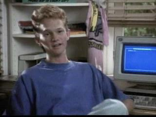

class: middle

```{r setup, include=FALSE}
options(htmltools.dir.version = FALSE)
```

```{r xaringanextra-tachyons}
xaringanExtra::use_tachyons()
```

---

> The computer is doing something that you’re telling it to do. You’re figuring out how to tell a computer ... how to jump through the hoops to make it happen. It’s creating something. It’s very much like being an artist.

Jared Lander


