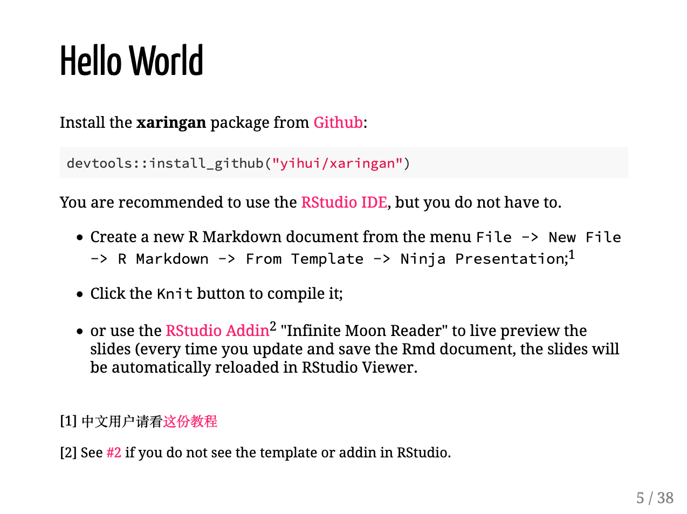

class: title-slide middle

# `r rmarkdown::metadata$title`

## `r rmarkdown::metadata$subtitle`

.author[
`r rmarkdown::metadata$author`
]

.twitter[
@grrrck
]


```{r setup, include=FALSE}
options(htmltools.dir.version = FALSE)
```

```{r xaringan-themer, include=FALSE, warning=FALSE}
library(xaringanthemer)
style_duo_accent(
  base_font_size = "24px",
  primary_color = "#1381B0",
  secondary_color = "#FF961C",
  inverse_header_color = "#FFFFFF",
  title_slide_text_color = "#FFFFFF",
  extra_fonts = list(
    google_font("Staatliches"),
    google_font("Megrim"),
    google_font("Pompiere")
  )
)

xaringanExtra::use_xaringan_extra(c("tile_view", "panelset", "editable", "animate", "tachyons"))
xaringanExtra::use_webcam(300 * 1.5, 300 / 4 * 3 * 1.5)
```

---

# What is xaringan?.red.not-last[*]

.w-50.pr3.fl[
.b.f4[R Markdown]

```markdown
---

# Hello Ninja

As a presentation ninja, you certainly should not be satisfied by the "Hello World" example. You need to understand more about two things:

1. The [remark.js](https://remarkjs.com) library;

1. The **xaringan** package;

Basically **xaringan** injected the 
chakra of R Markdown (minus Pandoc) 
into **remark.js**. The slides are 
rendered in the web browser...
```
]

.absolute.bottom-0.left-1.red.o-90.animated.delay-2s.slideInUp.not-last[
*All mispronunciations are my own
]

--

.w-50.fl[
.b.f4[HTML]

]

---
class: middle

.w-40.h-50.fl[
## Install xaringan

```{r eval=FALSE}
install.packages("xaringan")
```
]

--

.w-60.fr.right[
## Learn xaringan

.f3[
[slides.yihui.org/xaringan](https://slides.yihui.org/xaringan)  
[github.com/yihui/xaringan/wiki](https://github.com/yihui/xaringan/wiki)
]
]

---
class: hide-count
background-image: url('images/yihui.jpg')
background-size: cover

```{css echo=FALSE}
#arrow path {
  fill: white;
}

#arrow {
  transform: rotateY(180deg) scale(0.5);
  position: absolute;
  top: -30px;
  right: 330px;
}

.the-real-hero {
	color: white;
	font-size: 2.5em;
	position: absolute;
	top: 230px;
	right: 50px;
  font-family: Megrim,Pompiere,var(--header-font-family);
}
```

<div class="the-real-hero">thank you, yihui!</div>

<svg version="1.1" id="arrow" xmlns="http://www.w3.org/2000/svg" xmlns:xlink="http://www.w3.org/1999/xlink" x="0px" y="0px"
	 width="370.353px" height="370.353px" viewBox="0 0 370.353 370.353" style="enable-background:new 0 0 370.353 370.353;"
	 xml:space="preserve">
<g>
	<path d="M368.432,166.578c-23.256-19.584-42.84-42.84-63.648-64.872c-11.016-11.628-28.151-34.884-46.512-36.108
		c-1.224-1.836-3.06-3.06-7.344-2.448c-2.448,0.612-4.284,2.448-4.896,4.896c-3.672,14.076-3.06,28.764-3.06,43.452
		c-53.856-7.344-116.893,19.584-159.732,48.348C36.115,191.057-0.605,243.078,0.007,301.217c0,2.448,1.836,3.672,3.672,4.284
		c1.836,1.836,4.284,2.448,6.732,1.224c70.992-50.184,145.044-94.247,235.009-78.947h0.611c-5.508,17.748-6.119,37.943-6.119,56.304
		c0,5.508,4.896,7.344,8.567,6.732c1.836,2.447,6.12,4.283,9.18,1.224c40.393-33.66,84.456-71.604,111.385-117.503
		C370.88,172.698,370.88,168.414,368.432,166.578z M348.235,183.102c-10.403,15.3-23.868,28.764-37.332,42.228
		c-18.359,18.36-39.168,34.272-56.916,53.244c0-16.524-0.611-33.048,0.612-50.185c0-1.836-0.612-3.06-1.836-3.672
		c1.836-3.672,1.224-8.567-3.672-9.792c-88.741-18.972-170.749,23.256-239.292,77.112c9.18-53.856,41.004-94.248,86.904-124.848
		s93.637-36.72,146.269-42.84v0.612c-0.612,4.896,7.344,5.508,8.568,1.224c0-1.224,0.611-1.836,0.611-3.06
		c3.672-1.836,4.896-6.732,1.836-8.568c1.836-9.792,2.448-19.584,3.672-29.376c0-1.836,0.612-4.896,1.225-7.956
		c7.956,10.404,21.42,19.584,30.6,28.764c17.748,18.36,34.272,37.944,52.632,56.304
		C351.907,170.862,356.191,170.862,348.235,183.102z"/>
</g>
</svg>

---
class: middle

# Make Your Slides Extra Special

--

<div class="f1 pompiere mt3 mb4">xaringanExtra</div>

--

```{r eval=FALSE}
remotes::install_github("gadenbuie/xaringanExtra")
```

--

.f2.pompiere.right[
[pkg.garrickadenbuie.com/.b[xaringanExtra]](https://pkg.garrickadenbuie.com/xaringanExtra)
]


---
class: full-screen hide-count

<div class="grid-3-2">
<div class="extension-tile tileview animated flipInY"><div>Tile View</div></div>
</div>

---
layout: true
class: bigger

# Tile View

---

````markdown
```{r xaringan-tile-view, echo=FALSE}`r ''`

```
````

---

````markdown
```{r xaringan-tile-view, echo=FALSE}`r ''`
*xaringanExtra::use_tile_view()
```
````

--

Press .key[O] for overview

---
layout: false
class: full-screen hide-count

<div class="grid-3-2">
<div class="extension-tile tileview"><div>Tile View</div></div>
<div class="extension-tile panelset-tile animated flipInX"><div>Panelset</div></div>
</div>

---
class: bigger

.panelset[
.panel[.panel-name[Setup]

```{r xaringan-panelset, echo=FALSE}
xaringanExtra::use_panelset()
```

````markdown
```{r xaringan-panelset, echo=FALSE}`r ''`
*xaringanExtra::use_panelset()
```
````
]

.panel[.panel-name[Create a Panel]

````markdown
.panelset[
.panel[.panel-name[R Code]

```{r panel-chunk, fig.show='hide'}
# ... r code ...
```
]

.panel[.panel-name[Plot]

`)
]
]
````
]

.panel[.panel-name[Enjoy]

<video width="100%" height="100%" autoplay loop>
  <source src="images/tada.mp4" type="video/mp4">
  Your browser does not support the video tag.
</video> 
]
]

---
class: full-screen hide-count

<div class="grid-3-2">
<div class="extension-tile tileview"><div>Tile View</div></div>
<div class="extension-tile panelset-tile"><div>Panelset</div></div>
<div class="extension-tile webcam animated bounceInDown"><div>Webcam</div></div>
</div>

---
layout: true
class: bigger

## Enable .secondary[webcam]

---

````markdown
```{r xaringan-webcam, include = FALSE}`r ''`
*xaringanExtra::use_webcam()
```
````

---

````markdown
```{r xaringan-webcam, include = FALSE}`r ''`
*xaringanExtra::use_webcam(width = 300, height = 225)
```
````

--

.mt5[
Then press .key[w] to turn on the **webcam** 
]

--

.mt4[
Or .key[Shift] + .key[w] to cycle through the corners
]

---
layout: false
class: full-screen hide-count

<div class="grid-3-2">
<div class="extension-tile tileview"><div>Tile View</div></div>
<div class="extension-tile panelset-tile"><div>Panelset</div></div>
<div class="extension-tile webcam"><div>Webcam</div></div>
<div class="extension-tile editable animated fadeInRight"><div>Editable</div></div>
</div>

---

## Welcome to UseR!2020

.flex.tc[
.w-50.f2[
&#x1F4F6;  
<span autocomplete="off" autocorrect="off" autocapitalize="off" spellcheck="false" class="can-edit">wifi</span>
]
.w-50.f2[
&#x1F510;  
.can-edit[pwd]
]
]

---

## My Favorite .code[tidyverse] Functions

.can-edit.f3.code[
- one
- ...
]

---
layout: true
class: bigger

## Editable

````markdown
```{r xaringan-editable, include = FALSE}`r ''`
*xaringanExtra::use_editable()
```
````

---

Wrap in .b[`.can-edit[]`]

```markdown
*.can-edit[
- one
- ...
*]
```

---

Wrap in .b[`.can-edit[]`]

```markdown
The WiFi password is .can-edit[password].
```

---

Add `.can-edit`.b[`.key-<NAME>`]`[]` to save for _your browser_

```markdown
The WiFi password is .can-edit.key-password[password].
```

---
layout: false
class: full-screen hide-count

<div class="grid-3-2">
<div class="extension-tile tileview"><div>Tile View</div></div>
<div class="extension-tile panelset-tile"><div>Panelset</div></div>
<div class="extension-tile webcam"><div>Webcam</div></div>
<div class="extension-tile editable"><div>Editable</div></div>
<div class="extension-tile slide animated heartBeat"><div>Slide Tone</div></div>
</div>

---
class: bigger

## Slide Tone

````markdown
```{r xaringan-slide-tone, include = FALSE}`r ''`
*xaringanExtra::use_slide_tone()
```
````

--

.f3[
&#x1F50A; [.o-60[pkg.garrickadenbuie.com/].o-80[xaringanExtra/].secondary[slide-tone/]](https://pkg.garrickadenbuie.com/xaringanExtra/slide-tone/)
]


---
class: full-screen hide-count

<div class="grid-3-2">
<div class="extension-tile tileview"><div>Tile View</div></div>
<div class="extension-tile panelset-tile"><div>Panelset</div></div>
<div class="extension-tile webcam"><div>Webcam</div></div>
<div class="extension-tile editable"><div>Editable</div></div>
<div class="extension-tile slide"><div>Slide Tone</div></div>
<div class="extension-tile animate animated slideInLeft"><div>Animate</div></div>
</div>

---
class: animated slideInUp bigger

## Animate

````markdown
```{r xaringan-animate-css, echo=FALSE}`r ''`
*xaringanExtra::use_animate_css()
```
````

---
class: animated fadeIn fadeOutLeft bigger

## Animate

````markdown
```{r xaringan-animate-css, echo=FALSE}`r ''`
*xaringanExtra::use_animate_css()
```
````

```markdown
---
class: animated slideInRight fadeOutLeft

## This slide...

- slides in from the right 
- and fades out to the left on exit
```

---
class: bigger animated fadeInLeft

## Animate All The Slides

````markdown
```{r xaringan-animate-all, echo=FALSE}`r ''`
*xaringanExtra::use_animate_all("slide_left")
```
````

---
class: animated zoomIn
background-image: url(images/that-was-awesome.gif)
background-size: cover

---
layout: true
class: bigger

## Use xaringanExtra

---

````markdown
```{r xaringan-extra-all-the-things, echo=FALSE}`r ''`
xaringanExtra::use_tile_view()
xaringanExtra::use_panelset()
xaringanExtra::use_editable()
xaringanExtra::use_slide_tone()
xaringanExtra::use_animate_css()
```
````

---

````markdown
```{r xaringan-extra-all-the-things, echo=FALSE}`r ''`
*xaringanExtra::use_xaringan_extra(
* c("tile_view", "panelset", "editable", 
*   "slide_tone", "animate", "tachyons")
*)
```
````


---
layout: false
class: middle left


<p class="pompiere f1">&#x1F31F; <a href="https://github.com/gadenbuie/xaringanExtra"><span class="gray">gadenbuie</span>/xaringanExtra</a></p>

--

<p class="pompiere f1">&#x1F5E3; <a href="https://twitter.com/grrrck">&commat;grrrck</a></p>

--

<p class="pompiere f1">&#x1F468;&#x1F3FC;&#x200D;&#x1F4BB; <a href="https://garrickadenbuie.com">garrickadenbuie.com</a></p>
