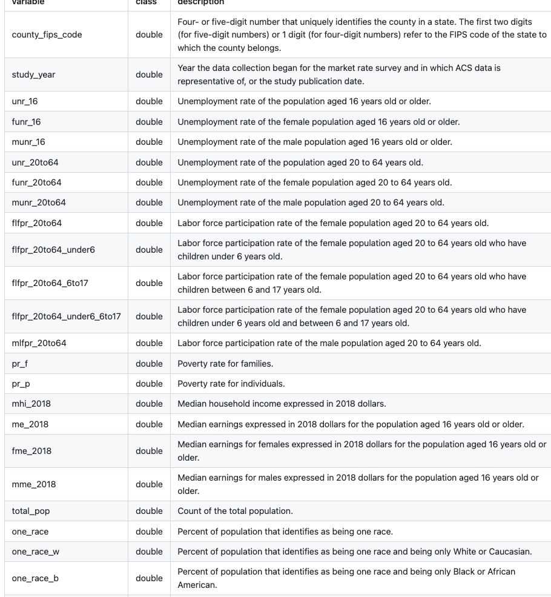
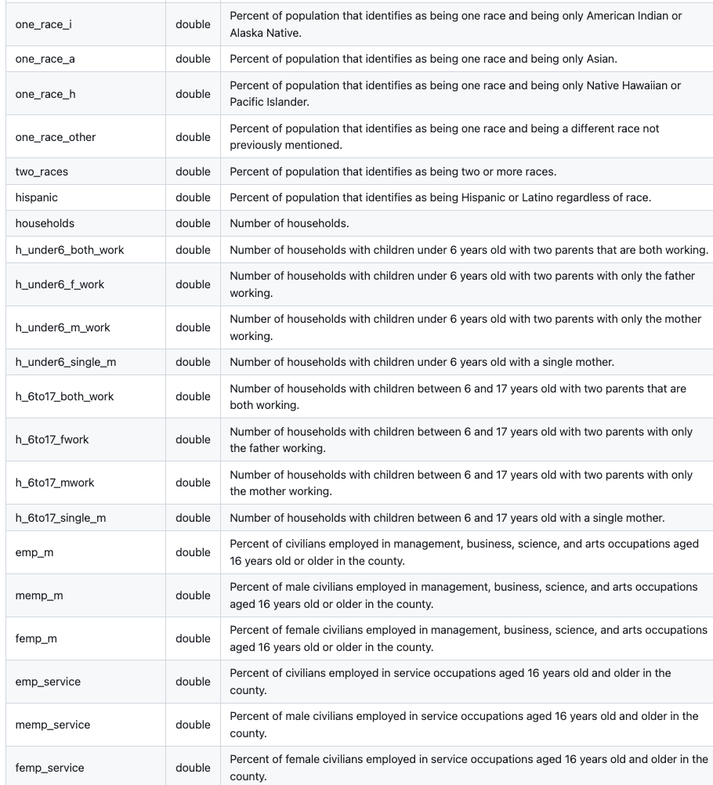
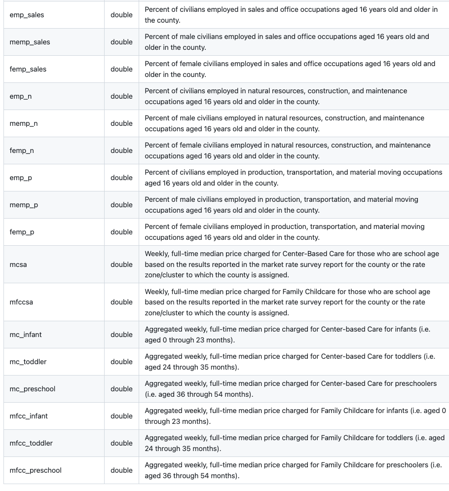
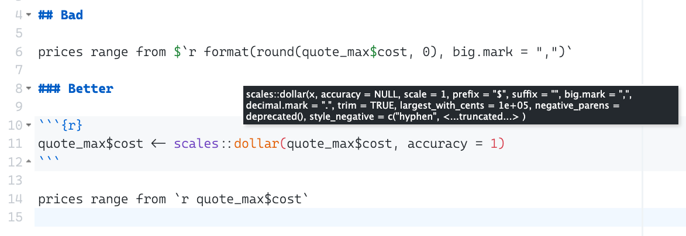

background-size: cover
background-position: bottom right
background-image: url(images/tanaphong-toochinda-GagC07wVvck-unsplash.jpg)

```{r setup, include = FALSE, cache = FALSE}
library(glue)
library(epoxy)
library(tidyverse)

FAST_RENDER <- FALSE

options(htmltools.dir.version = FALSE, width = 80)
knitr::opts_chunk$set(comment = "#>", cache = FAST_RENDER)

og_output <- knitr::knit_hooks$get("output")
knitr::knit_hooks$set(output = function(x, options) {
  if (isTRUE(options$code_html)) {
    browser()
    x <- paste0("\n```html\n", x, "\n```\n")
  }
  og_output(x, options)
})


xaringanExtra::use_xaringan_extra(c("tachyons", "animate_css", "tile_view"))
xaringanExtra::use_extra_styles(hover_code_line = TRUE, mute_unhighlighted_code = TRUE)
```

```{r setup-fansi, echo = FALSE, comment="", results="asis", eval = !FAST_RENDER}
options(crayon.enabled = TRUE)
Sys.setenv(R_CLI_NUM_COLORS = 256)
old.hooks <- fansi::set_knit_hooks(knitr::knit_hooks, which=c("output", "warning", "error", "message"))
```

```{r load-tidy-tuesday, include = FALSE}
if (!file.exists("data-raw/tuesdata.rds")) {
  <<download-tidy-tuesday>>
  saveRDS(tuesdata, file = "data-raw/tuesdata.rds")
} else {
  tuesdata <- readRDS("data-raw/tuesdata.rds")

  childcare_costs <- tuesdata$childcare_costs
  counties <- tuesdata$counties
}
```

.footnote[
.bg-white-blur[Photo by <a href="https://unsplash.com/photos/GagC07wVvck">Tanaphong Toochinda</a>]
]

???
I recently learned an interesting fact about childcare costs in the U.S.
in a report by the Department of Labor:


---
layout: true
name: quote

`r paste(readLines("_snippets/childcare-quote2.md"), collapse = "\n")`

.footnote[
[National Database of Childcare Prices](https://www.dol.gov/newsroom/releases/wb/wb20230124)
]

---

???
\[read quote\]

If you're anything like me, one part of you is saying "wow, children are expensive".
(at least in the U.S.)
The other part of you is thinking about the raw data behind this sentence.

You're probably noticing the qualifiers...

---
class: hl-qualifier

???

You're probably noticing the qualifiers in this quote,
like [read qualifiers].

You're thinking about how these qualifiers map
to decisions about how the data was summarized.

And you're definitely thinking about all of the numbers in this quote...

---
class: hl-number

???
... like [read numbers]

And now you're completely distracted thinking about the process behind this quote.

* Where did the data come from?
* How hard was it to clean?
* How did it go from rows in a table to this sentence in the report?
* I mean that literally, like, what happens if we find an error or a state updates a CSV file somewhere? Who's job is it to come back to this sentence and update it?

---
layout: false
background-image: url(images/la-rel-easter-KuCGlBXjH_o-unsplash.jpg)
background-size: 115%
background-position: bottom center

.footnote.white[
Photo by <a href="https://unsplash.com/photos/KuCGlBXjH_o">La-Rel Easter</a>
]

???

When we talk about data-driven reporting,
I think it's important to acknowledge how many decisions
we pack into the tight spaces between our words.

---

```{r}
#| echo: false
<<childcare_summary-1>>
<<childcare_summary-2>>
<<childcare_summary-3>>

saveRDS(childcare_summary, file = "data-raw/childcare_summary.rds")
```

```{r}
childcare_summary
```

???

All of these descisions manifest in a data frame or two.
And it's extra satisfying when they're tidy.

This table plugs in very nicely into dense tables and plots,
which we're as data scientists lean on heavily.

---
background-image: url('images/map-plot.png')
background-size: 85%
background-position: bottom center

.clip[
Slide image: a map of the U.S. with each county shaded by median yearly price of
infant center-based care.
Chester County, PA is highlighted and an pop-over lists related statistics about the county.
]

.footnote[
.f6[[Women's Bureau](https://www.dol.gov/agencies/wb/topics/childcare/price-by-age-care-setting)]
]

???

Like this map of the U.S.
comparing the median yearly price of infant center-based care.

This map is great (and it's even interactive!)
but it has its place.
No reasonable person is going to use this map
and arrive at the conclusions of our quote.

---

```{r plot-basic}
#| echo: false
#| fig.width: 8
#| fig.height: 4.5
#| out.width: 100%
#| dpi: 150
ggplot(childcare_summary) +
  aes(cost, age, fill = type) +
  geom_col(position = "dodge") +
  facet_wrap(~ county_size) +
  theme_grey(14)
```

???

Or this super basic horizontal bar plot.
I just took the table and passed it to ggplot,
mapping childcare costs to the x-axis and the child's age group to the y-axis.
I faceted by county size and I set the bar color to the type of care:
home-based or center-based care.

---

```{r}
#| ref.label: plot-basic
#| eval: false
```

???

This only takes a few lines of code.

But ggplot also gives you all kinds of tools
to help you take the raw data and map it
to labels and text that's easier to understand.

---

```{r}
#| ref.label: plot-fancy
#| eval: false
```

???

With a few more lines of code

---

```{r}
#| eval: false
ggplot(childcare_summary) +
  aes(cost, age, fill = type) +
  geom_col(position = "dodge") +
  facet_wrap(
    ~ county_size,
    labeller = labeller(county_size = \(x) str_to_title(paste(x, "County")))
  ) +
  labs( #<<
    x = "Median yearly cost", #<<
    y = "Age group", #<<
    fill = "Type of care" #<<
  ) + #<<
  scale_fill_discrete(labels = \(x) paste0(x, "-based")) +
  scale_x_continuous(
    labels = scales::dollar_format(scale_cut = scales::cut_short_scale())
  ) +
  theme_gray(14)
```

???

we can give the axis and legend appropriate labels

---

```{r}
#| eval: false
ggplot(childcare_summary) +
  aes(cost, age, fill = type) +
  geom_col(position = "dodge") +
  facet_wrap(
    ~ county_size,
    labeller = labeller(county_size = \(x) str_to_title(paste(x, "County")))
  ) +
  labs(
    x = "Median yearly cost",
    y = "Age group",
    fill = "Type of care"
  ) +
  scale_fill_discrete(labels = \(x) paste0(x, "-based")) +
  scale_x_continuous( #<<
    labels = scales::dollar_format(scale_cut = scales::cut_short_scale()) #<<
  ) + #<<
  theme_gray(14)
```

???

And we can format the x-axis in U.S. dollars

---

```{r}
#| eval: false
ggplot(childcare_summary) +
  aes(cost, age, fill = type) +
  geom_col(position = "dodge") +
  facet_wrap(
    ~ county_size,
    labeller = labeller(county_size = \(x) str_to_title(paste(x, "County"))) #<<
  ) +
  labs(
    x = "Median yearly cost",
    y = "Age group",
    fill = "Type of care"
  ) +
  scale_fill_discrete(labels = \(x) paste0(x, "-based")) + #<<
  scale_x_continuous(
    labels = scales::dollar_format(scale_cut = scales::cut_short_scale())
  ) +
  theme_gray(14)
```

???

or give the facets and legends better labels

To end up with a plot like this...

---

```{r plot-fancy}
#| echo: false
#| fig.width: 8
#| fig.height: 4.5
#| out.width: 100%
#| dpi: 150
ggplot(childcare_summary) +
  aes(cost, age, fill = type) +
  geom_col(position = "dodge") +
  facet_wrap(
    ~ county_size,
    labeller = labeller(county_size = \(x) str_to_title(paste(x, "County")))
  ) +
  labs(
    x = "Median yearly cost",
    y = "Age group",
    fill = "Type of care"
  ) +
  scale_fill_discrete(labels = \(x) paste0(x, "-based")) +
  scale_x_continuous(
    labels = scales::dollar_format(scale_cut = scales::cut_short_scale())
  ) +
  theme_gray(14)
```

???

But these updates all happen between our data frame
and the last few lines of code.

---

```{r}
childcare_summary
```

???

Meaning that we didn't have to change our source data frame at all.

---
class: middle f1 highlight-last-item

<h2 class="f1" style="font-size:3rem">epoxy</h2>

* .f3[Handle .pink.b[last-mile] transformations]

???

I started working on epoxy because I wanted
better tools that help you make these kinds of
last-mile transformations easier.

--

* .f3[Seamlessly use data in .pink.b[the prose] of reports and apps]

???

Tools that make it seamless to blend data into prose

--

* .f3[Re-usability through .pink.b[templates] and global settings]

???

And that improve usability through templates and global settings

---
class: middle center animated slideInDown slideOutDown

.center.w-50[

]

???

The good news is that there's an awesome package called glue
that does most of what I wanted but for strings in R.

It's biggest limitation is that it's a developer-oriented package,
meaning that it's designed to do one thing well with a minimal API
and basically zero dependencies.

---
class: middle center animated slideInDown

.center.w-50[

]

???

So you could consider epoxy an extension package for glue,
which also explains the name and the hex sticker.

---
class: middle

.f2.code[
install.packages(.pink["epoxy"]) <br />
.silver[pak::pak("gadenbuie/epoxy")] <br />
<br />
library(.pink[epoxy]) <br />
.silver[library(glue)]
]

???

You can install epoxy from CRAN and load it in the usual ways.

I'm loading glue here too for later in the presentation,
but you don't need to do that to use epoxy.

---
class: inverse center middle

# Let's try this together

.f3.f-zilla.dib.animated.lightSpeedIn.delay-1s[(speed run)]


---
layout: true

## TidyTuesday (2023, Week 19)

---

```{r download-tidy-tuesday, eval = FALSE, output = FALSE}
library(tidyverse)

tuesdata <- tidytuesdayR::tt_load(2023, week = 19)

childcare_costs <- tuesdata$childcare_costs
counties <- tuesdata$counties
```

???

First of all, huge thanks to the TidyTuesday project where I discovered this dataset.
They also make it super easy to download the dataset and start working with it.

---

```{r}
counties
```

???

The data come with two data sets (which were originally one set).
Counties and states...

---

```{r}
childcare_costs
```

???

And the main attraction, the child care costs.

---
layout: false

## Data Dictionary: `childcare_costs`





---

```{comment}
Small county: counties with a population of 1-99,999.
Mid-sized county: counties with a population of 100,000-499,999.
Large county: counties with a population of 500,000-999,999.
Very large county: counties with a population of 1,000,000 or more.
```

.flex[
.w-25[
## Prepare

* 2018 only

* Where reported

* Pick: population, income, price

* County size
]

.w-75.pl2[
```{r childcare_summary-1}
childcare_summary <-
  childcare_costs |>
  filter(study_year == 2018, !is.na(mc_infant)) |>
  select(1:2, total_pop, mhi_2018, matches("mfcc|mc")) |>
  mutate(
    county_size = case_when(
      total_pop < 1e5 ~ "small",
      total_pop < 5e5 ~ "mid-sized",
      total_pop < 1e6 ~ "large",
      TRUE ~ "very large"
    ),
    county_size = fct_reorder(county_size, total_pop)
  )
```

```{r R.options = list(width = 60, tibble.view_max = 5)}
#| echo: false
childcare_summary |> print(n = 5)
```
]
]

---

.flex[
.w-25[
## Pivot

* Collect all costs

* Extract information from variable names

* Recode age and type

* Convert to yearly cost
]

.w-75.pl2[
```{r childcare_summary-2}
childcare_summary <-
  childcare_summary |>
  pivot_longer(
    cols = matches("mfcc|mc"),
    names_to = c("type", "age"),
    names_pattern = "(mfcc|mc)(.*)",
    values_to = "cost"
  ) |>
  mutate(
    age = str_remove(age, "^_"),
    age = recode(age, sa = "school-age"),
    age = factor(age, c("infant", "toddler", "preschool", "school-age")),
    type = recode(type, mfcc = "home", mc = "center"),
    cost = cost * 52
  )
```

```{r R.options = list(width = 60, tibble.view_max = 5)}
#| echo: false
childcare_summary |> print(n = 4)
```
]
]

---


.flex[
.w-25[
## Summarize

* Median cost and income

* By county size, care type and age group

* Cost as a % of income
]

.w-75.pl2[
```{r childcare_summary-3}
childcare_summary <-
  childcare_summary |>
  summarize(
    across(cost, \(x) median(x, na.rm = TRUE)),
    across(mhi_2018, \(x) median(x, na.rm = TRUE)),
    .by = c(county_size, type, age)
  ) |>
  mutate(mhi_pct = cost / mhi_2018) |>
  select(-mhi_2018)
```

```{r R.options = list(width = 60, tibble.view_max = 5)}
#| echo: false
childcare_summary |> print(n = 10)
```
]
]

---

.flex[
.w-25[
## Quote

* Min/max cost
]

.w-75.pl2[
```{r costs_min}
costs_min <-
  childcare_summary |>
  filter(mhi_pct == min(mhi_pct))
```

```{r R.options = list(width = 60, tibble.view_max = 5)}
#| echo: false
costs_min
```

```{r costs_max}
costs_max <-
  childcare_summary |>
  filter(mhi_pct == max(mhi_pct))
```

```{r R.options = list(width = 60, tibble.view_max = 5)}
#| echo: false
costs_max
```
]
]

---

.flex[
.w-25[
## Quote

* Also counts of counties and states
]

.w-75.pl2[
```{r echo = c(-4, -6)}
counties_states <-
  childcare_costs |>
  filter(study_year == 2018, !is.na(mc_infant)) |>
  left_join(counties, by = "county_fips_code") |>
  distinct(state_abbreviation, county_name)

n_counties <- nrow(counties_states)
n_counties
n_states <- n_distinct(counties_states$state_abbreviation)
n_states
```
]
]

---
class: inverse center middle

# How do we get this into prose?

---

```{r}
costs_min
costs_max
```

---
layout: true

## R Markdown is amazing

---

````{verbatim lang = "markdown"}
A study of childcare prices in
2,360
U.S. counties across
47
states shows that childcare prices
for a single child
range from
$4,810
for school-age home-based care
in small counties to
$15,417
for infant center-based care
in very large counties.
This is equivalent to between
8% and 19.3%
of median family income per child in paid care.
````

???

Here's our sentence as if we've written it out in an `.Rmd` file.

I've broken it up into a lot of lines so that the changes are easier to read as we modify this.

---

````{verbatim lang = "markdown"}
A study of childcare prices in
____
U.S. counties across
____
states shows that childcare prices
for a single child
range from
$____
for school-age home-based care
in small counties to
$____
for infant center-based care
in very large counties.
This is equivalent to between
____% and ____%
of median family income per child in paid care.
````

???

But when we're coming up with a sentence like this, we don't know what the numbers are going to be.

So let's replace these with blanks.

---

````{verbatim lang = "markdown"}
A study of childcare prices in
____
U.S. counties across
____
states shows that childcare prices
for a single child
range from
$____
for school-age home-based care
in ____ counties to
$____
for infant center-based care
in ____ counties.
This is equivalent to between
____% and ____%
of median family income per child in paid care.
````

???

We also don't know which county sizes we're going to be talking about.

---

````{verbatim lang = "markdown"}
A study of childcare prices in
____
U.S. counties across
____
states shows that childcare prices
for a single child
range from
$____
for school-age ____-based care
in ____ counties to
$____
for infant ____-based care
in ____ counties.
This is equivalent to between
____% and ____%
of median family income per child in paid care.
````

???

Or the type of childcare or educational center

---

````{verbatim lang = "markdown"}
A study of childcare prices in
____
U.S. counties across
____
states shows that childcare prices
for a single child
range from
$____
for ____ ____-based care
in ____ counties to
$____
for ____ ____-based care
in ____ counties.
This is equivalent to between
____% and ____%
of median family income per child in paid care.
````

???

Or even which age group will be involved in the least and most expensive categories.

---

````{verbatim lang = "markdown"}
A study of childcare prices in
`r n_counties` #<<
U.S. counties across
`r n_states` #<<
states shows that childcare prices
for a single child
range from
$____ #<<
for ____ ____-based care #<<
in ____ counties to #<<
$____ #<<
for ____ ____-based care #<<
in ____ counties. #<<
This is equivalent to between
____% and ____% #<<
of median family income per child in paid care.
````

???

And then we work our way forward, using inline code chunks to blend our data into the text.

---

````{verbatim lang = "markdown"}
A study of childcare prices in
`r n_counties` #<<
U.S. counties across
`r n_states` #<<
states shows that childcare prices
for a single child
range from
`r costs_min$cost` #<<
for `r costs_min$age` `r costs_min$type`-based care #<<
in `r costs_min$county_size` counties to #<<
$____ #<<
for ____ ____-based care #<<
in ____ counties. #<<
This is equivalent to between
`r costs_min$mhi_pct` and ____% #<<
of median family income per child in paid care.
````

???

Then all the pieces we know from the minimum cost category

---

````{verbatim lang = "markdown"}
A study of childcare prices in
`r n_counties` #<<
U.S. counties across
`r n_states` #<<
states shows that childcare prices
for a single child
range from
`r costs_min$cost` #<<
for `r costs_min$age` `r costs_min$type`-based care #<<
in `r costs_min$county_size` counties to #<<
`r costs_max$cost` #<<
for `r costs_max$age` `r costs_max$type`-based care #<<
in `r costs_max$county_size` counties. #<<
This is equivalent to between
`r costs_min$mhi_pct` and `r costs_max$mhi_pct` #<<
of median family income per child in paid care.
````

???

and everything we know from the maximum cost category

---
layout: true

## R Markdown is amazing.pink[-ish]

---

A study of childcare prices in <br/>
`r n_counties` <br/>
U.S. counties across <br/>
`r n_states` <br/>
states shows that childcare prices <br/>
for a single child <br/>
range from <br/>
`r costs_min$cost` <br/>
for `r costs_min$age` `r costs_min$type`-based care <br/>
in `r costs_min$county_size` counties to <br/>
`r costs_max$cost` <br/>
for `r costs_max$age` `r costs_max$type`-based care <br/>
in `r costs_max$county_size` counties. <br/>
This is equivalent to between <br/>
`r costs_min$mhi_pct` and `r costs_max$mhi_pct` <br/>
of median family income per child in paid care.

???

And then we render it... and it's amazing.
I mean, it's fine.
It's great that we're not copying and pasting numbers into our documents!
But this isn't quite right.

---

````{verbatim lang = "markdown"}
A study of childcare prices in
`r format(n_counties, big.mark = ",")` #<<
U.S. counties across
`r format(n_states, big.mark = ",")` #<<
states shows that childcare prices
for a single child
range from
$`r format(costs_min$cost, big.mark = ",")` #<<
for `r costs_min$age` `r costs_min$type`-based care #<<
in `r costs_min$county_size` counties #<<
$`r format(round(costs_max$cost, 0), big.mark = ",")` #<<
for `r costs_max$age` `r costs_max$type`-based care #<<
in `r costs_max$county_size` counties. #<<
This is equivalent to between
`r round(costs_min$mhi_pct * 100, 2)`% and `r round(costs_max$mhi_pct * 100, 2)`% #<<
of median family income per child in paid care.
````

???

But these are inline code chunks, right, so we can just write some code around the values.

---
layout: true
class: center middle

## Spicy hot-take time

---

---

.f2.absolute.center.left-0.w-100[
.animated.fadeInDownBig.dib.delay-staggered[&#x1F336;&#xFE0F;]
.animated.fadeInDownBig.dib.delay-staggered[.o-30[&#x1F336;&#xFE0F;]]
.animated.fadeInDownBig.dib.delay-staggered[.o-30[&#x1F336;&#xFE0F;]]
.animated.fadeInDownBig.dib.delay-staggered[.o-30[&#x1F336;&#xFE0F;]]
.animated.fadeInDownBig.dib.delay-staggered[.o-30[&#x1F336;&#xFE0F;]]
]

---

.f2.absolute.center.left-0.w-100.f-pen.animated.slideInLeft[
Write R code where it can be R code.
]

---
layout: false
class: middle

### .red[Bad]

````{verbatim lang = "markdown"}
prices range from $`r format(round(costs_max$cost, 0), big.mark = ",")`
````

--

### .silver[Better]

````{verbatim lang = "markdown"}
```{r}
costs_max$cost <- format(round(costs_max$cost, 0), big.mark = ",")
```

prices range from $`r costs_max$cost`
````

--

### .green[Better-er]

````{verbatim lang = "markdown"}
```{r}
costs_max$cost <- scales::dollar(costs_max$cost, accuracy = 1)
```

prices range from `r costs_max$cost`
````

---
class: center middle



--

.f3.absolute.center.left-0.w-100.f-pen.animated.slideInLeft[
Inline code is for the simplist code you cannot possibly mess up.
]

---
layout: true
class: animated fadeIn

## R Markdown .pink[&plus; epoxy]

---

````{verbatim lang = "markdown"}
A study of childcare prices in
`r n_counties`
U.S. counties across
`r n_states`
states shows that childcare prices
for a single child
range from
`r costs_min$cost`
for `r costs_min$age` `r costs_min$type`-based care
in `r costs_min$county_size` counties to
`r costs_max$cost`
for `r costs_max$age` `r costs_max$type`-based care
in `r costs_max$county_size` counties.
This is equivalent to between
`r costs_min$mhi_pct` and `r costs_max$mhi_pct`
of median family income per child in paid care.
````

---


````{verbatim lang = "markdown"}
```{r} #<<
library(epoxy) #<<
``` #<<

A study of childcare prices in
`r n_counties`
U.S. counties across
`r n_states`
states shows that childcare prices
for a single child
range from
`r costs_min$cost`
for `r costs_min$age` `r costs_min$type`-based care
in `r costs_min$county_size` counties to
`r costs_max$cost`
for `r costs_max$age` `r costs_max$type`-based care
in `r costs_max$county_size` counties.
This is equivalent to between
`r costs_min$mhi_pct` and `r costs_max$mhi_pct`
of median family income per child in paid care.
````

---

````{verbatim lang = "markdown"}
```{r}
library(epoxy)
```

```{epoxy} #<<
A study of childcare prices in
`r n_counties`
U.S. counties across
`r n_states`
states shows that childcare prices
for a single child
range from
`r costs_min$cost`
for `r costs_min$age` `r costs_min$type`-based care
in `r costs_min$county_size` counties to
`r costs_max$cost`
for `r costs_max$age` `r costs_max$type`-based care
in `r costs_max$county_size` counties.
This is equivalent to between
`r costs_min$mhi_pct` and `r costs_max$mhi_pct`
of median family income per child in paid care.
``` #<<
````

---

````{verbatim lang = "markdown"}
```{r}
library(epoxy)
```

```{epoxy}
A study of childcare prices in
`r n_counties` #<<
U.S. counties across
`r n_states` #<<
states shows that childcare prices
for a single child
range from
`r costs_min$cost` #<<
for `r costs_min$age` `r costs_min$type`-based care #<<
in `r costs_min$county_size` counties to #<<
`r costs_max$cost` #<<
for `r costs_max$age` `r costs_max$type`-based care #<<
in `r costs_max$county_size` counties. #<<
This is equivalent to between
`r costs_min$mhi_pct` and `r costs_max$mhi_pct` #<<
of median family income per child in paid care.
```
````

---

````{verbatim lang = "markdown"}
```{r}
library(epoxy)
```

```{epoxy}
A study of childcare prices in
{n_counties} #<<
U.S. counties across
{n_states} #<<
states shows that childcare prices
for a single child
range from
{costs_min$cost} #<<
for {costs_min$age} {costs_min$type}-based care #<<
in {costs_min$county_size} counties to #<<
{costs_max$cost} #<<
for {costs_max$age} {costs_max$type}-based care #<<
in {costs_max$county_size} counties. #<<
This is equivalent to between
{costs_min$mhi_pct} and {costs_max$mhi_pct} #<<
of median family income per child in paid care.
```
````

---

````{verbatim lang = "markdown"}
```{r}
library(epoxy)
```

```{epoxy}
A study of childcare prices in
{n_counties}
U.S. counties across
{n_states}
states shows that childcare prices
for a single child
range from
{costs_min$cost}
for {costs_min$age} {costs_min$type}-based care
in {costs_min$county_size} counties to
{costs_max$cost}
for {costs_max$age} {costs_max$type}-based care
in {costs_max$county_size} counties.
This is equivalent to between
{costs_min$mhi_pct} and {costs_max$mhi_pct}
of median family income per child in paid care.
```
````

---
layout: false
class: center middle

<video controls loop playsinline width="100%">
  <source src="images/epoxy-autocomplete.mov" type="video/mp4">
</video>

---
layout: false

## R Markdown .pink[&plus; epoxy] is amazing.pink.animated.dib.rotateInDownLeft.delay-2s[-ish]

```{epoxy}
A study of childcare prices in <br/>
{n_counties} <br/>
U.S. counties across <br/>
{n_states} <br/>
states shows that childcare prices <br/>
for a single child <br/>
range from <br/>
{costs_min$cost} <br/>
for {costs_min$age} {costs_min$type}-based care <br/>
in {costs_min$county_size} counties to <br/>
{costs_max$cost} <br/>
for {costs_max$age} {costs_max$type}-based care <br/>
in {costs_max$county_size} counties. <br/>
This is equivalent to between <br/>
{costs_min$mhi_pct} and {costs_max$mhi_pct} <br/>
of median family income per child in paid care.
```

---
layout: true
class: center middle
---

.code.f1[
&#96;r costs_max$.primary[cost]&#96;
]

---

.code.f1[
{costs_max$.primary[cost]}
]

---

.code.f1[
{.pink[.dollar] costs_max$.primary[cost]}
]

---

.code.f1[
{.pink[.pct] costs_max$.primary[mhi_pct]}
]

---

.code.f1[
{.pink[.comma] .primary[n_counties]}
]

--

.code.f3[
scales::label_.pink[comma]()(.primary[n_counties])
]

---
layout: true
class: animated fadeIn

## R Markdown .pink[&plus; epoxy] is amazing.pink.animated.dib.jackInTheBox[-er]

---

````{verbatim lang = "markdown"}
```{r include=FALSE}
library(epoxy)
```

```{epoxy}
A study of childcare prices in {.comma n_counties} U.S. counties across
{n_states} states shows that childcare prices for a single child range from
{.dollar costs_min$cost} for {costs_min$age} {costs_min$type}-based care
in {costs_min$county_size} counties to {.dollar costs_max$cost} for
{costs_max$age} {costs_max$type}-based care in {costs_max$county_size} counties.
This is equivalent to between {.pct costs_min$mhi_pct} and
{.pct costs_max$mhi_pct} of median family income per child in paid care.
```
````

---

```{epoxy}
A study of childcare prices in {.comma n_counties} U.S. counties across
{n_states} states shows that childcare prices for a single child range from
{.dollar costs_min$cost} for {costs_min$age} {costs_min$type}-based care
in {costs_min$county_size} counties to {.dollar costs_max$cost} for
{costs_max$age} {costs_max$type}-based care in {costs_max$county_size} counties.
This is equivalent to between {.pct costs_min$mhi_pct} and
{.pct costs_max$mhi_pct} of median family income per child in paid care.
```

---
layout: true

## .pink[epoxy] is built on .orange[glue]

---

```{r}
glue("for a single child range from {costs_min$cost}")
```

--

```{r}
epoxy("for a single child range from {costs_min$cost}")
```

---

```{r error = TRUE}
glue("for a single child range from {.dollar costs_min$cost}")
```

```{r}
epoxy("for a single child range from {.dollar costs_min$cost}")
```

---
layout: false

## These are the same

.mt3[
### .Rmd

````{verbatim lang = "markdown"}
```{epoxy}
for a single child range from {.dollar costs_min$cost}
```
````

```{epoxy}
for a single child range from {.dollar costs_min$cost}
```
]

.mt4[
### .R

```{r}
epoxy("for a single child range from {.dollar costs_min$cost}")
```
]

---
layout: true

## Inline transformations with epoxy

---

```{r}
epoxy(
  "range from {.dollar costs_min$cost} to {.dollar costs_max$cost}"
)
```

---

```{r}
epoxy(
  "range from {.dollar costs_min$cost} to {.dollar costs_max$cost}",
  .transformer = epoxy_transform_inline()
)
```

---

```{r}
epoxy(
  "range from {.dollar costs_min$cost} to {.dollar costs_max$cost}",
  .transformer = epoxy_transform_inline(
    .dollar = scales::label_dollar()
  )
)
```

---

```{r}
epoxy(
  "range from {.dollar costs_min$cost} to {.dollar costs_max$cost}",
  .transformer = epoxy_transform_inline(
    .dollar = scales::label_dollar(accuracy = 10)
  )
)
```

---

```{r}
epoxy_transform_set(
  .dollar = scales::label_dollar(accuracy = 10)
)

epoxy(
  "range from {.dollar costs_min$cost} to {.dollar costs_max$cost}"
)
```

---
layout: true

## Inline transformations with epoxy

```{r echo = 1}
ages <- childcare_summary |> count(age) |> mutate(across(age, paste))
ages
```

---

```{r}
epoxy("children were in the age groups {ages$age}")
```

---

```{r}
epoxy("children were in the age groups {.and ages$age}")
```

---

```{r}
epoxy("children were in the age groups {.or ages$age}")
```

---
layout: true

## Inline transformations with epoxy

---

```{r}
epoxy("age groups ranged from {.to ages$age}")
```

---

```{r set-inline-to}
epoxy_transform_set(
  .to = function(x) {
    glue_collapse(x, sep = ", ", last = " to ")
  }
)

epoxy("age groups ranged from {.to ages$age}")
```

---

```{r dependson="set-inline-to"}
epoxy("age groups ranged from {.to {.titlecase ages$age}}")
```

---

```{r dependson="set-inline-to"}
epoxy("age groups ranged from {.to {.tc ages$age}}")
```

---

```{r}
epoxy(
  "These slides were rendered on {.date now()} at {.time now()}."
)
```

.footnote.o-80[
`now()` is from `lubridate`, which is now loaded with `library(tidyverse)`!
]

---

```{r}
epoxy(
  "These slides were rendered on {.date now()} at {.time now()}.",
  .transformer = c("inline", "bold")
)
```

---
layout: true

## epoxy for .pink[LaTeX]

---

```{r}
epoxy("prices in {.comma n_counties} U.S. counties")
```

--

```{r}
epoxy("prices in {{.comma n_counties}} U.S. counties")
```

---

```{r}
epoxy("prices in \\textbf{{.comma n_counties}} U.S. counties")
```

--

```{r}
epoxy("prices in \\textbf{{{.comma n_counties}}} U.S. counties")
```

---

```{r}
epoxy_latex("prices in \\textbf{<.comma n_counties>} U.S. counties")
```

--

<div class="mv5"></div>

This is equivalent to an `epoxy_latex` chunk...

````{verbatim}
```{epoxy_latex}
prices in \\textbf{<.comma n_counties>} U.S. counties
```
````

...but the output of `epoxy_latex` chunks render in LaTeX outputs.

---
layout: true

## epoxy for .pink[HTML]

---

```{r epoxy-html}
epoxy_html("prices in <strong>{{.comma n_counties}}</strong> U.S. counties")
```

--

````html
```{r ref.label="epoxy-html", echo = FALSE}
```
````

---

```{r epoxy-html-1}
epoxy_html("prices in {{.comma n_counties}} U.S. counties")
```

````html
```{r ref.label="epoxy-html-1", echo = FALSE}
```
````

---

```{r epoxy-html-2}
epoxy_html("prices in {{strong n_counties}} U.S. counties")
```

````html
```{r ref.label="epoxy-html-2", echo = FALSE}
```
````

---

```{r epoxy-html-3}
epoxy_html("prices in {{strong {{.comma n_counties}}}} U.S. counties")
```

````html
```{r ref.label="epoxy-html-3", echo = FALSE}
```
````

---
layout: false
class: inverse center middle

# Templating small and large

---
layout: true

# Data-masked chunks

---

````{verbatim lang="markdown"}
```{epoxy}
{costs_min$cost} for {costs_min$age} {costs_min$type}-based care
in {costs_min$county_size} counties
```
````

```{epoxy}
{costs_min$cost} for {costs_min$age} {costs_min$type}-based care
in {costs_min$county_size} counties
```

---

````{verbatim lang="markdown"}
```{epoxy data=costs_min} #<<
{.dollar costs_min$cost} for {costs_min$age} {costs_min$type}-based care
in {costs_min$county_size} counties
```
````

```{epoxy}
{.dollar costs_min$cost} for {costs_min$age} {costs_min$type}-based care
in {costs_min$county_size} counties
```


---

````{verbatim lang="markdown"}
```{epoxy data=costs_min}
{.dollar cost} for {age} {type}-based care #<<
in {county_size} counties #<<
```
````

```{epoxy data=costs_min}
{.dollar cost} for {age} {type}-based care
in {county_size} counties
```

---

````{verbatim lang="markdown"}
```{epoxy data=costs_min}
{.dollar cost} for {age} {type}-based care in {county_size} counties
```
````

```{epoxy data=costs_min}
{.dollar cost} for {age} {type}-based care in {county_size} counties
```

--

````{verbatim lang="markdown"}
```{epoxy data=costs_max}
{.dollar cost} for {age} {type}-based care in {county_size} counties
```
````

```{epoxy data=costs_max}
{.dollar cost} for {age} {type}-based care in {county_size} counties
```


---
layout: true

## Tiny templates with .pink[ref.label]

---

````{verbatim lang="markdown"}
```{epoxy cost-summary, data=costs_min}
{.dollar cost} for {age} {type}-based care in {county_size} counties
```
````

```{epoxy cost-summary, data=costs_min}
{.dollar cost} for {age} {type}-based care in {county_size} counties
```

````{verbatim lang="markdown"}
```{epoxy ref.label = "cost-summary", data=costs_max}
```
````

```{epoxy ref.label = "cost-summary", data=costs_max}
```


---

````{verbatim lang = "markdown"}
A study of childcare prices in
```{epoxy}
{.comma n_counties} U.S. counties across {n_states} states
```
shows that childcare prices for a single child range from
```
```{epoxy ref.label = "cost-summary", data=costs_min}
```
to
```{epoxy ref.label = "cost-summary", data=costs_max}
```
per year. This is equivalent to between
```{epoxy}
{.pct costs_min$mhi_pct} and {.pct costs_max$mhi_pct}
```
of median family income per child in paid care.
````

---

.w-two-thirds.mt4.lh-copy[
A study of childcare prices in
```{epoxy}
{.comma n_counties} U.S. counties across {n_states} states
```
shows that childcare prices for a single child range from
```{epoxy ref.label = "cost-summary", data=costs_min}
```
to
```{epoxy ref.label = "cost-summary", data=costs_max}
```
per year. This is equivalent to between
```{epoxy}
{.pct costs_min$mhi_pct} and {.pct costs_max$mhi_pct}
```
of median family income per child in paid care.
]

---
layout: false
class: inverse center middle

# &#x2728; Shiny Apps &#x2728;

---
layout: true

## epoxy in .pink[Shiny apps]

---

```r
radioButtons("county_size", "County Size", ...),
radioButtons("type", "Childcare Type", ...),
radioButtons("age", "Age Group", ...)
```

--

```r
p(
  "The median childcare cost for a single ",
  "AGE in TYPE-based care",
  "is COST in COUNTY_SIZE counties."
)
```


---

.o-50[
```r
radioButtons("county_size", "County Size", ...),
radioButtons("type", "Childcare Type", ...),
radioButtons("age", "Age Group", ...)
```
]

```r
ui_epoxy_html(
  .id = "summary",
  p(
    "The median childcare cost for a single ",
    "{{ age }} in {{ type }}-based care",
    "is {{ cost }} in {{ county_size }} counties."
  )
)
```

--

```r
output$summary <- render_epoxy(
  age = input$age,
  type = input$type,
  county_size = input$county_size,
  cost = ...
)
```

---

```r
output$summary <- render_epoxy(
  age = input$age,
  type = input$type,
  county_size = input$county_size,
  cost = cost()$cost
)
```

--

```r
cost <- reactive({
  childcare_summary |>
    filter(
      age == input$age,
      type == input$type,
      county_size == input$county_size
    ) |>
    mutate(cost = scales::dollar(cost, accuracy = 1))
})
```

---
layout: false
class: center middle

## Demo Time Field Trip

---
class: highlight-last-item

## But wait, .pink[there's more!]

--

* You can use `{{ }}` anywhere (almost) in any UI element!

  .silver[Try .code[run_epoxy_example_app("ui_epoxy_html")]]

--

* You can use markdown instead with `ui_epoxy_markdown()`

  .silver[Try .code[run_epoxy_example_app("ui_epoxy_markdown")]]

--

* Mustache templates with `ui_epoxy_mustache()` (and the `whisker` engine)

  .silver[Try .code[run_epoxy_example_app("ui_epoxy_mustache")]]

---

## Thanks!

### Learn more about epoxy

-   [Get to know epoxy](https://pkg.garrickadenbuie.com/epoxy/) .silver[(.code[pkg.garrickadenbuie.com/epoxy])]

-   Would love to hear from you or help you use epoxy!
    Come to the [discussion board](https://github.com/gadenbuie/epoxy/discussions)

-   [slides.garricakdenbuie.com/seamless-epoxy](https://slides.garrickadenbuie.com/seamless-epoxy)

### About me

- Read: [garrickadenbuie.com](https://www.garrickadenbuie.com)

- Chat: [&commat;grrrck&commat;fosstodon.org](https://fosstodon.org/@grrrck)

- Code: [&commat;gadenbuie](https://github.com/gadenbuie)

.f3.mt4.blue[
&#x1F647;&#x200D;&#x2642;&#xFE0F; Thank you R/Medicine!
]


