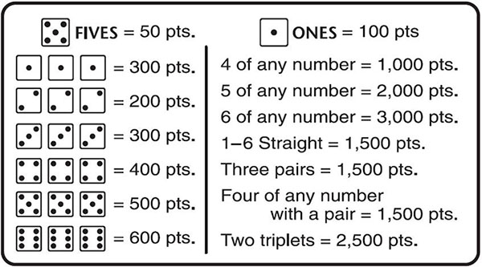

class: middle right hide-count
background-image: url(https://source.unsplash.com/jiUNAQb6Cfk/1600x900)
background-size: cover

```{r setup, include=FALSE}
options(htmltools.dir.version = FALSE)
knitr::opts_chunk$set(
  fig.width = 10, fig.height = 6, fig.retina = 2,
  warning = FALSE, message = FALSE
)
```

```{r js4shiny, echo=FALSE}
xaringanExtra::use_xaringan_extra(c("tile_view", "editable", "share_again"))
js4shiny::html_setup(stylize = c("fonts", "variables", "code"))
```

# .purple[10,000 Reasons to<br>Love Functions]

## .gray[Garrick Aden-Buie]

---
exclude: true

1. Farkle, rules and example
1. Declarative programming
1. Refactor into a function... what is a function?
1. Functions reduce copy/paste
1. Functions encapsulate logic
 - Declare assumptions
1. Functions simplify logic
1. Functions can be **composed** (`magrittr`, `purrr`)
1. Functions can be **parallel** (`furrr`)
1. Functions can be packaged (`usethis`)
1. Functions can be tested (`testthat`)
1. Functions can be debugged
1. Functions can be modified
1. Functions can be documented (`roxygen2`)
1. Documentation can be beautiful (`pkgdown`)
1. Functions can be coordinated (`drake`)

---
class: fullscreen
background-image: url(assets/img/farkle.jpg)
background-size: contain

---
layout: true

# Farkle Rules

.w-50.h-100.fl.mt3.pr4[

]

---

.w-50.fl.mt3[
```{r echo=FALSE}
scoring <- tibble::tribble(
  ~ Combination, ~ Score,
  "Single 5", "50",
  "Single 1", "100",
  "3 x N of a kind", "N * 100",
  "4:6 of a Kind", "(n - 3) * 1000",
  "3 Pairs", "1500",
  "Straight", "1500",
  "2 Triplets", "2500"
)

gt::gt(scoring)
```
]

---

```{r, include=FALSE}
html_dice <- function(dice, size = "lg") {
  size <- paste0("fa-", size)
  emoji_dice <- list(
    htmltools::span(class = "red", shiny::icon("dice-one", size)),
    htmltools::span(class = "gold", shiny::icon("dice-two", size)),
    htmltools::span(class = "blue", shiny::icon("dice-three", size)),
    htmltools::span(class = "purple", shiny::icon("dice-four", size)),
    htmltools::span(class = "dark-green", shiny::icon("dice-five", size)),
    htmltools::span(class = "navy", shiny::icon("dice-six", size))
  )
  htmltools::tagList(emoji_dice[dice])
}
```

.w-50.fr.f7[
You rolled...

```{r echo=FALSE}
html_dice(c(1, 4, 5, 4, 5, 4))
```
]

--

.w-50.fr.f7[
- `r html_dice(c(4, 4, 4))` = 400

- `r html_dice(1)` = 100

- `r html_dice(c(5, 5))` = 50 x 2
]

--

.w-50.fr.f7[
And you get to roll again
]

---

.w-50.fr.f7[
Score: **600**. On your next roll...

```{r echo=FALSE}
html_dice(c(2, 2, 5, 4, 1, 3))
```
]

--

.w-50.fr.f7[
You can choose one or both of

- `r html_dice(1)` = 100

- `r html_dice(5)` = 50
]

--

.w-50.fr.f7[
Pick the `r html_dice(1)`, roll **5** dice
]

---

.w-50.fr.f7[
Current Score: **700**

```{r echo=FALSE}
html_dice(c(5, 4, 5, 4, 6))
```
]

--

.w-50.fr.f7[
You can choose one or both of

- `r html_dice(5)` = 50

- `r html_dice(5)` = 50
]

--

.w-50.fr.f7[
Pick both `r html_dice(5)`, roll **3** dice
]

---

.w-50.fr.f7[
Current Score: **800**
]

--

.w-50.fr.f7[
```{r echo=FALSE}
html_dice(c(6, 2, 3))
```
]

--

.w-50.fr.f7[
.red.b[FARKLE! &#x1F622;]

Final Score: ~~800~~
]

---
layout: true

# How to roll computer dice

---

```{r}
n_dice_to_roll <- 6
dice_values <- 1:6
sample(dice_values, size = n_dice_to_roll, replace = FALSE)
```

--

```{r}
roll_dice <- function(n_dice_to_roll) { #<<
  dice_values <- 1:6
  sample(dice_values, size = n_dice_to_roll, replace = FALSE)
} #<<
```

```{r}
roll_dice(6)
```

---

```{r}
roll_dice <- function(n) {
  sample(1:6, size = n, replace = FALSE)
}
```

--

```{r}
(dice_rolled <- roll_dice(6))
```

--

```{r}
html_dice(dice_rolled, size = "3x")
```

---

```{r}
lapply(1:5, function(...) roll_dice(n = 6))
```

---

```{r}
roll_dice <- function(n) {
  sample(1:6, size = n, replace = TRUE) #<<
}
```

--

```{r}
html_dice(roll_dice(6), size = "3x")
```

--

```{r}
html_dice(roll_dice(6), size = "3x")
```

---

```{r}
lapply(1:5, function(...) roll_dice(n = 6))
```

---
layout: true

# Anatomy of a Function

.f5.mt5[
```
roll_dice <- function(n) {
  sample(1:6, size = n, replace = TRUE)
}
```
]

---

---
background-image: url(assets/img/function-anatomy-3.jpg)
background-size: cover

---
background-image: url(assets/img/function-anatomy-4.jpg)
background-size: cover

---
background-image: url(assets/img/function-anatomy-5.jpg)
background-size: cover

---
layout: true

# Anatomy of a Function

---

.f5[
```{r eval=FALSE}
roll_dice <- function(n) {
  if (n > 6) { #<<
    stop("Can't roll more than 6 dice") #<<
  } #<<
  sample(1:6, size = n, replace = TRUE)
}
```
]

---

.f5[
```{r eval=FALSE}
roll_dice <- function(n) {
  if (n > 6) {
    stop("Can't roll more than 6 dice")
  }
  if (n < 1) { #<<
    stop("Must roll at least 1 die") #<<
  } #<<
  sample(1:6, size = n, replace = TRUE)
}
```
]

---
layout: false
class: break center middle break-blue-pink

# A Farkle Roll

.w-50.f6.mh-auto.tl[
- Roll the dice in your hand
]
--

.w-50.f6.mh-auto.tl[
- Count the dice you rolled
]
--

.w-50.f6.mh-auto.tl[
- Score the dice combinations
]
--

.w-50.f6.mh-auto.tl[
- Choose which dice to keep and which dice to re-roll
]

---

# Roll the dice in your hand

```{r}
set.seed(2020-05+15)
dice_rolled <- roll_dice(6)
```

```{r}
html_dice(dice_rolled, "3x")
```

---
layout: true

# Count the dice you rolled

```{r count-dice, eval=FALSE}
library(dplyr, warn.conflicts = FALSE)
tibble(value = dice_rolled) %>% count(value)
```

---

```{r ref.label="count-dice", echo=FALSE}
```

---

```{r}
count_dice <- function(dice) {
  dplyr::tibble(value = dice) %>% dplyr::count(value)
}
```

--

```{r}
(dice_counted <- count_dice(dice_rolled))
```

---
layout: false

# Score the dice combinations

.w-third.fl[
```{r echo=FALSE}
scoring %>% arrange(-row_number()) %>% gt::gt()
```
]

--

.w-two-thirds.fr.pl3[
- Check if we have the combination

- Identify the dice used

- Score the dice combination

- Remove dice used from future scoring
]

--

.w-two-thirds.fr[
```{r}
dice_rolled_ex <- 1:6
dice_counted_ex <- count_dice(dice_rolled_ex)

if (identical(dice_counted_ex$value, 1:6)) {
  score <- 1500
  dice_counted_ex$n <- 0
}
```
]

---
layout: true

# Score 3 of a Kind

.w-30.fl.pr2[
- Check for combo

- Identify dice

- Score combination

- Remove dice

```{r}
dice_counted
```

]

---

.w-70.fr.can-edit[
```{r eval=FALSE}
# Pseudo-code is okay
if (condition) {
  
}
```
]

---

.w-70.fr[
```{r eval=FALSE}
dice_counts <- dice_counted$n
dice_values <- dice_counted$value

if (any(dice_counts == 3)) { #<<
  # 3 of a kind #<<
  for (used in which(dice_counts == 3)) { #<<
    value <- dice_values[used] #<<
    # three ones is 300 #<<
    if (value == 1) value <- 3 #<<
    score <- value * 100 #<<
    dice_counts[used] <- 0 #<<
  } #<<
} #<<
```
]

---
layout: true
class: last-output-only

# Score 3 of a Kind with Functions

---

```{r}
has_3_of_kind <- function(dice_counted) {
  if (sum(dice_counted$n) < 3) return(FALSE)
  any(dice_counted$n == 3)
}

identify_3_of_kind <- function(dice_counted) {
  # get largest dice value first
  dice_counted %>%
    filter(n == 3) %>%
    tail(n = 1) %>%
    transmute(value, use = 3)
}

score_3_of_kind <- function(dice_identified) {
  tibble(used = 3, score = dice_identified$value * 100)
}
```

---

```{r eval=FALSE}
has_3_of_kind <- function(dice_counted) { #<<
  if (sum(dice_counted$n) < 3) return(FALSE)
  any(dice_counted$n == 3)
}

identify_3_of_kind <- function(dice_counted) { #<<
  # get largest dice value first
  dice_counted %>%
    filter(n == 3) %>%
    tail(n = 1) %>%
    transmute(value, use = 3)
}

score_3_of_kind <- function(dice_identified) { #<<
  value <- dice_identified$value
  tibble(used = 3, score = ifelse(value ==1, 3, value) * 100)
}
```

---

```{r}
dice_counted
```

--

```{r}
has_3_of_kind(dice_counted)
```

--

```{r}
(dice_used <- identify_3_of_kind(dice_counted))
```

--

```{r}
(combo_score <- score_3_of_kind(dice_used))
```

---

.flex[
.w-50.pr4[
```{r}
dice_counted
```
]
.w-50[
```{r}
dice_used
```

]
]

--

```{r}
use_dice <- function(dice_counted, dice_used) {
  left_join(dice_counted, dice_used, by = "value") %>%
    mutate(use = ifelse(is.na(use), 0, use)) %>%
    transmute(value, n = n - use) %>%
    filter(n > 0)
}
```

---

.flex[
.w-third.pr1[
```{r}
dice_counted
```
]
.w-third.pr1[
```{r}
dice_used
```
]
.w-third[
```{r}
combo_score
```
]
]

--

.dummy[
```{r}
(dice_left <- use_dice(dice_counted, dice_used))
```
]

---
layout: false

# Score a Roll

```{r eval=FALSE}
score_roll <- function(dice) {
  n_dice <- length(dice)
  dice_counted <- count_dice(dice)
  
  score_combos <- NULL
  
  # ... check for high points first ...
  
  if (has_3_of_kind(dice_counted)) {
    dice_used    <- identify_3_of_kind(dice_counted)
    combo_score  <- score_3_of_kind(dice_used)
    score_combos <- bind_rows(score, combo_score)
    dice_counted <- use_dice(dice_counted, dice_used)
  }
  
  # ... return score options ...
}
```

---

# When to use functions?

--

.w-80[
> You should consider writing a function whenever you’ve **copied and pasted** a block of code **more than twice** (i.e. you now have three copies of the same code).
> <cite>R for Data Science</cite>
]

--

.w-two-thirds.tr.fr[
> Sure, but functions are useful<br>**even if you only call them once**<br>
> <cite>Me, right now</cite>
]

---
class: break bg-purple middle

# .white[A few reasons to love functions]

--

.absolute.bottom-0.right-1.white[
.f6[*]The exact moment when this talk went off the rails
]

---

# Functions can be **packaged**

.f5.code[
[usethis.r-lib.org](https://usethis.r-lib.org)
]

```{r usethis, eval=FALSE}
usethis::create_package("farkle")
```

.absolute.bottom-1.right-1[

]

---

# Functions can be **tested**

.f5.code[
[testthat.r-lib.org](https://testthat.r-lib.org)
]

```{r testthat, eval=FALSE}
usethis::use_testthat()
# Open your R file
usethis::use_test()
```

.absolute.bottom-1.right-1[

]

---

# Functions can be **debugged**

- Use your tests

- Use break points

- Use `debug()` or `debugOnce()`

- Use `options(error = recover)`

---

# Functions can be **modified**

- Use your tests as a safety net

- You know what .green.b[goes in] and what should .b.red[come out]

---

# Functions can be **documented**

.f5.code[
[roxygen2.r-lib.org](https://roxygen2.r-lib.org)
]

```{r roxygen2, eval=FALSE}
#' Function Title
#' 
#' Function description (paragraph)
#' 
#' @param n Number of dice to roll
#' @export
roll_dice <- function(n) {
  # ...
}
```

.absolute.bottom-1.right-1[

]

---

# Functions documentation can be **beautiful**

.f5.code[
[pkgdown.r-lib.org](https://pkgdown.r-lib.org)
]

```{r pkgdown, eval=FALSE}
pkgdown::init_site()
pkgdown::build_site()
```

.absolute.bottom-1.right-1[

]

---

# Functions can be tested, **continuously**

.f5.code[
[maxheld.de/ghactions](https://www.maxheld.de/ghactions/)
]

```{r ghactions, eval=FALSE}
ghactions::use_ghactions(workflow = ghactions::website())
```

.absolute.bottom-1.right-2.w-20[

]

---

# Functions can be **coordinated**

.f5.code[
[docs.ropensci.org/drake](https://docs.ropensci.org/drake)
]

```{r drake, eval=FALSE}
drake::use_drake()
```

.absolute.bottom-1.right-2.w-20[

]
