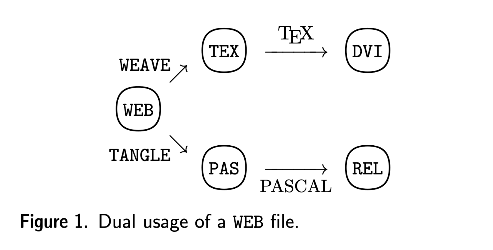
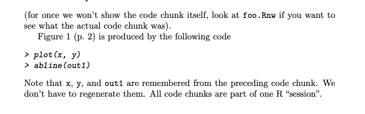
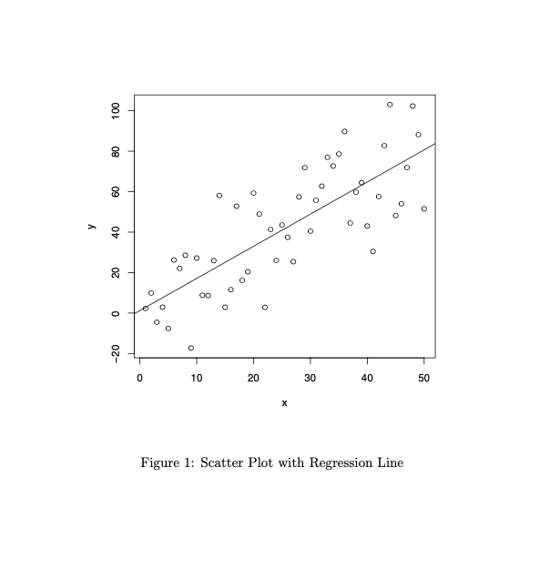
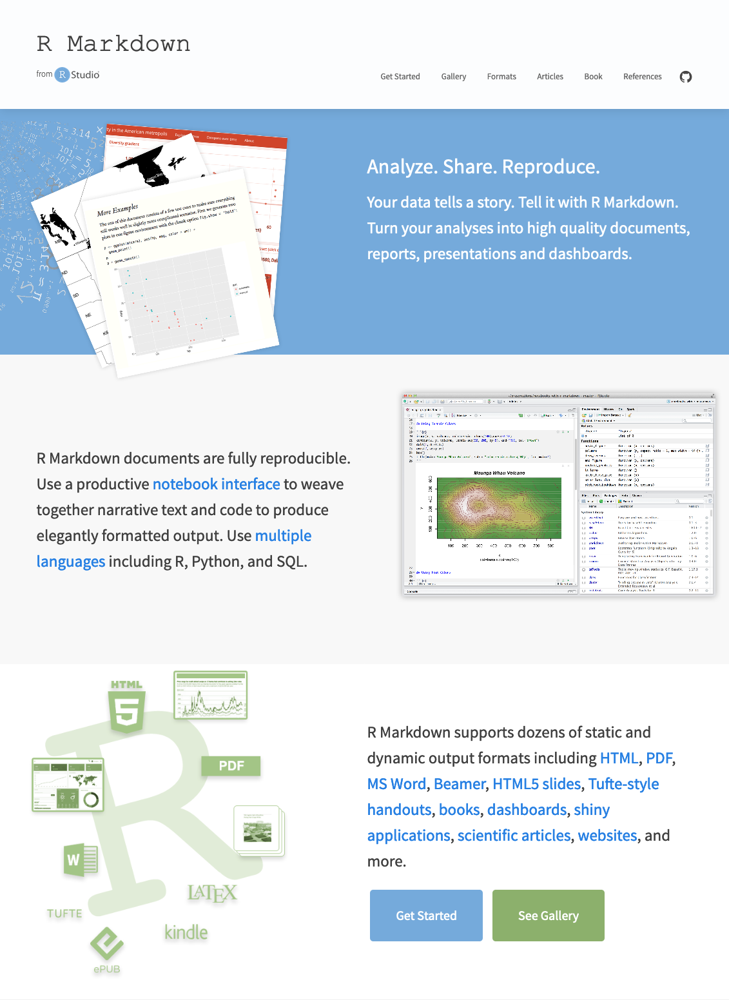

```{r setup, include=FALSE}
library(epoxy)
library(dplyr)
options(htmltools.dir.version = FALSE, width = 70)

knitr::opts_chunk$set(
  fig.width=9, fig.height=3.5, fig.retina=3,
  out.width = "100%",
  cache = FALSE,
  echo = FALSE,
  message = FALSE,
  warning = FALSE,
  fig.show = FALSE,
  hiline = TRUE
)

`%||%` <- function(x, y) if (is.null(x)) y else x

rewrite_chunk <- function(label, include_label = FALSE, nbt = 3) {
  chunk <- knitr::knit_code$get(label)
  opts <- attr(chunk, "chunk_opts")
  bt <- strrep("`", nbt)
  engine <- opts$engine %||% "r"
  exclude <- c("engine")
  if (is.logical(include_label) && !isTRUE(include_label)) {
    exclude <- c(exclude, "label")
  }
  if (is.character(include_label)) {
    label <- include_label
  }
  opts <- opts[setdiff(names(opts), exclude)]
  opts <- paste(
    vapply(names(opts), FUN.VALUE = character(1), function(on) {
      paste0(
        if (on != "label") paste(on, "= "), 
        if (is.character(opts[[on]])) {
          if (on == "label") label else dQuote(opts[[on]], q = 0) 
        } else {
          deparse(opts[[on]])
        }
      )
    }),
    collapse = ", "
  )
  header <- paste0(bt, "{", engine, if (length(opts) && nzchar(opts)) " ", opts, "}")
  paste(
    header,
    paste(chunk, collapse = "\n"),
    bt,
    sep = "\n"
  )
}
```

name: title
class: top hide-count center
layout: true

<!-- Title Slide -->
.talk-title[
# `r rmarkdown::metadata$title`
]

<div class="talk-band left">
<div class="talk-author f-zilla">`r rmarkdown::metadata$author`</div>
<div class="talk-twitter code">&commat;grrrck</div>
</div>
<div class="talk-band right">
<div class="code">`r paste(rmarkdown::metadata$location, collapse = ", ")`</div>
<div class="code">`r paste(rmarkdown::metadata$date, collapse = ", ")`</div>
</div>

---

---

## .pink.f-pompiere.absolute.w-100.left-0.animated.bounceInUp[R's Secret Ingredient]

---

## .pink.f-pompiere.absolute.w-100.left-0.animated.bounceOutUp.faster[R's Secret Ingredient]

## .pink.f-pompiere.absolute.w-100.left-0.animated.bounceInUp[R's Special Sauce]

---

## .pink.f-pompiere.absolute.w-100.left-0.animated.bounceOutUp.faster[R's Special Sauce]

## .pink.f-pompiere.absolute.w-100.left-0.animated.bounceInUp[An Incomplete History]

---

## .pink.f-pompiere.absolute.w-100.left-0.animated.bounceOutUp.faster[An Incomplete History]

## .pink.f-pompiere.absolute.w-100.left-0.animated.bounceInUp[Stuff I'm Working On and Want To Show Off]

---
layout: false

# About Me

.f2[
&#x1F44B; Hi, I'm **Garrick Aden-Buie**
]

--

.f2[
&#x1F426; [&commat;grrrck](https://twitter.com/grrrck)
]

--

.f2[
&#x1F9D1;&#x200D;&#x1F4BB; [garrickadenbuie.com](https://garrickadenbuie.com)
]

--

.f2[
&#xAE;&#xFE0F; [RStudio](https://rstudio.com): [.code[gradethis]](https://github.com/rstudio-education/gradethis), [.code[learnr]](https://github.com/rstudio/learnr)
]

---
background-image: url('https://source.unsplash.com/2LJ4rqK2qfU')
background-size: cover
background-position: center center
background-repeat: no-repeat
layout: false
class: right top

# What is R Markdown?

(wrong answers only)

.can-edit.f-pen.f2[
one  
two
]

---
class: pv0 ph3 middle

<div class="f1 lh-title f-zilla">
.b[Break Free From Plastic] engaged 14,734 volunteers in 
55 countries to conduct 575 brand audits. 
These volunteers collected 346,494 pieces of plastic waste.
</div>

---
class: pv0 ph3 middle

<div class="f1 lh-title f-zilla">
.b[Break Free From Plastic] engaged .hl[14,734] volunteers in 
.hl[55] countries to conduct .hl[575] brand audits. 
These volunteers collected .hl[346,494] pieces of plastic waste.
</div>

---
class: bg-gray middle hide-count

.f1.f-zilla.white[
A brief history of<br/>
.code.f2[rmarkdown]
]

---
class: fullscreen hide-count

<div class="fl w-30 h-100 animated slideInLeft" style="background-image: url(assets/img/80s-phone.jpg);background-size: cover;background-position: center right;">
</div>

---
class: fullscreen hide-count

<div class="fl w-30 h-100" style="background-image: url(assets/img/80s-phone.jpg);background-size: cover;background-position: center right;">
</div>

<div class="fl w-70 h-100 bl bw3 b--white animated slideInRight" style="background-image: url(assets/img/iphone-kitchen-stand.jpg);background-size: cover;background-position: center center;">
</div>

---
class: bg-gray middle hide-count

.f1.f-zilla.white[
A brief history of<br/>
_literate programming_
]

---
layout: true


.side-foot-note[Donald Knuth]

.footnote[[Literate Programming](https://www.cs.tufts.edu/~nr/cs257/archive/literate-programming/01-knuth-lp.pdf)]

---

.f-typewriter.f3.lh-title[
Let  us  change  our  traditional  attitude  
to  the  construction  of  programs:  

__Instead  of__  imagining  that  our main task  
is to __instruct a computer what to do__,  
let us concentrate rather on  
__explaining to human beings__  
what we want a computer to do.
]

---

.f-typewriter.f3.lh-title[
I  was coerced like everybody else into  
adopting the ideas of structured programming,  
because I couldn’t bear to be found guilty of  
writing **unstructured programs**.  

Now I have a chance to get even ...  
surely nobody wants to admit  
writing an **illiterate program**.
]

---

.f-typewriter.f3.lh-title[
This language and its associated programs  
have come to be known as **the WEB system**.

I  chose  the  name **WEB** partly because  
it  was  one  of the  few three-letter  
words of English that  hadn’t  
already been applied to computers.
]

---
class: middle faded-knuth



.footnote[[Literate Programming](https://www.cs.tufts.edu/~nr/cs257/archive/literate-programming/01-knuth-lp.pdf)]

???

A WEB user writes a program that serves as the source language  for  two  different  system  routines.   (See  Figure  1.)   One  line  of  processing  is  called weaving the web;  it  produces  a  document  that  describes  the  program clearly and that facilitates program maintenance. The other line of processing is called tangling the web; it  produces  a  machine-executable  program.   The  program and its documentation are both generated from the same source, so they are consistent with each other.

---
class: faded-knuth

.f-typewriter.f3[
The result of the program will be to produce a list of the first thousand prime numbers...
]

.f-typewriter.f4[
〈Program to print the first thousand prime numbers 2〉≡   
.b[program] .i[print_primes] (.i[output]);  
&nbsp;&nbsp;.b[const] *m* = 1000;  
&nbsp;&nbsp;〈Other constants of the program 5〉  
&nbsp;&nbsp;.b[var]〈Variables of the program 4〉  
&nbsp;&nbsp;&nbsp;&nbsp;.b[begin]〈Print the first *m* prime numbers 3〉;  
&nbsp;&nbsp;&nbsp;&nbsp;.b[end].
]

---
class: faded-knuth

.f-typewriter.f3[
We shall proceed to fill out the rest of the program by making whatever decisions seem easiest at each step.

So let's come up with a list of prime numbers.
]

.f-typewriter.f4[
〈Print the first .i[m] prime numbers 3〉≡   
&nbsp;&nbsp;〈Fill table .i[p] with the first .i[m] prime numbers 11〉  
&nbsp;&nbsp;〈Print table .i[p] 8〉
]

---
class: faded-knuth

.f-typewriter.f3[
Now that the appropriate auxiliary variables have been introduced,
the process of outputting table .i[p] almost writes itself.
]

.f-typewriter.f4[
〈Print table .i[p] 8〉≡   
&nbsp;&nbsp;.b[begin] .i[page_number] <- 1; .i[page_offset] = 1;  
&nbsp;&nbsp;.b[while] .i[page_offset] &leq; .i[m] .b[do]  
&nbsp;&nbsp;&nbsp;&nbsp;.b[begin]〈Output a page of answers 9〉;     
&nbsp;&nbsp;&nbsp;&nbsp;.i[page_number] <- .i[page_number] + 1;  
&nbsp;&nbsp;&nbsp;&nbsp;.i[page_offset] <- .i[page_offset] + rr * cc;  
&nbsp;&nbsp;&nbsp;&nbsp;.b[end];  
&nbsp;&nbsp;.b[end];
]

---
layout: false

```{r include = FALSE}
if (!file.exists("assets/img/code-comments.png")) {
  tweetrmd::tweet_screenshot(
    "https://twitter.com/mirmirik/status/1358658926720520192",
    file = "assets/img/code-comments.png"
  )
}
```

<div class="fl w-50 h-100 ba bw3 b--white animated slideInLeft" style="background-image: url(assets/img/code-comments-1.png);background-size: contain;background-position: center center;background-repeat:no-repeat;">
</div>

<div class="fl w-50 h-100 ba bw3 b--white animated slideInRight" style="background-image: url(assets/img/code-comments-2.png);background-size: contain;background-position: center center;background-repeat:no-repeat;">
</div>

---
class: bg-gray middle hide-count

.f1.f-zilla.white[
A brief history of<br/>
_literate programming_<br/>
in R
]


---
layout: true
class: no-margins

# sweave

---
background-image: url(assets/img/rotary-phone.jpg)
background-size: cover
background-position: center center

---

```latex
\documentclass{article}

\usepackage{amsmath}
\usepackage{amscd}
\usepackage[utf8]{inputenc}

\begin{document}
\SweaveOpts{concordance=TRUE}

\title{An Sweave Demo}
\author{Charles J. Geyer}
\maketitle

% .... 

```

---

.overflow-hidden.relative[
.animated.slideOutUp.absolute[
```latex
\documentclass{article}

\usepackage{amsmath}
\usepackage{amscd}
\usepackage[utf8]{inputenc}

\begin{document}
\SweaveOpts{concordance=TRUE}

\title{An Sweave Demo}
\author{Charles J. Geyer}
\maketitle

% .... 

```
]

.animated.slideInUp[
```
This is a demo for using the \verb@Sweave@ command in R.  To
get started make a regular \LaTeX\ file (like this one) but
give it the suffix \verb@.Rnw@ instead of \verb@.tex@ and then
turn it into a \LaTeX\ file (\verb@foo.tex@) with the (unix) command
\begin{verbatim}
R CMD Sweave foo.Rnw
\end{verbatim}

Well, we can now include R in our document.  Here's a simple example
<<two>>=
2 + 2
@
```
]
]

---

.overflow-hidden.relative[
.animated.slideOutUp.absolute[
```
This is a demo for using the \verb@Sweave@ command in R.  To
get started make a regular \LaTeX\ file (like this one) but
give it the suffix \verb@.Rnw@ instead of \verb@.tex@ and then
turn it into a \LaTeX\ file (\verb@foo.tex@) with the (unix) command
\begin{verbatim}
R CMD Sweave foo.Rnw
\end{verbatim}

Well, we can now include R in our document.  Here's a simple example
<<two>>=
2 + 2
@
```
]

.animated.slideInUp[
```latex
Figure~\ref{fig:one} (p.~\pageref{fig:one})
is produced by the following code
<<label=fig1plot,include=FALSE>>=
plot(x, y)
abline(out1)
@
\begin{figure}
\begin{center}
<<label=fig1,fig=TRUE,echo=FALSE>>=
<<fig1plot>>
@
\end{center}
\caption{Scatter Plot with Regression Line}
\label{fig:one}
\end{figure}
Note that \verb@x@, \verb@y@, and \verb@out1@ are remembered from
the preceding code chunk.  We don't have to regenerate them.
All code chunks are part of one R ``session''.
```
]
]

---

```latex
Figure~\ref{fig:one} (p.~\pageref{fig:one})
is produced by the following code
*<<label=fig1plot,include=FALSE>>=
*plot(x, y)
*abline(out1)
*@
\begin{figure}
\begin{center}
*<<label=fig1,fig=TRUE,echo=FALSE>>=
*<<fig1plot>>
*@
\end{center}
\caption{Scatter Plot with Regression Line}
\label{fig:one}
\end{figure}
Note that \verb@x@, \verb@y@, and \verb@out1@ are remembered from
the preceding code chunk.  We don't have to regenerate them.
All code chunks are part of one R ``session''.
```

--




---

```latex
Figure~\ref{fig:one} (p.~\pageref{fig:one})
is produced by the following code
*<<label=fig1plot,include=FALSE>>=
plot(x, y)
abline(out1)
*@
\begin{figure}
\begin{center}
*<<label=fig1,fig=TRUE,echo=FALSE>>=
<<fig1plot>>
*@
\end{center}
\caption{Scatter Plot with Regression Line}
\label{fig:one}
\end{figure}
Note that \verb@x@, \verb@y@, and \verb@out1@ are remembered from
the preceding code chunk.  We don't have to regenerate them.
All code chunks are part of one R ``session''.
```

---

```latex
Figure~\ref{fig:one} (p.~\pageref{fig:one})
is produced by the following code
*<<label=fig1plot,include=FALSE>>=
plot(x, y)
abline(out1)
@
\begin{figure}
\begin{center}
<<label=fig1,fig=TRUE,echo=FALSE>>=
*<<fig1plot>>
@
\end{center}
\caption{Scatter Plot with Regression Line}
\label{fig:one}
\end{figure}
Note that \verb@x@, \verb@y@, and \verb@out1@ are remembered from
the preceding code chunk.  We don't have to regenerate them.
All code chunks are part of one R ``session''.
```

--



---
layout: true

# knitr

---

---

<div class="fr w-75 h-100 bl bw3 b--white animated slideInRight absolute right-2 top-2" style="background-image: url(assets/img/zach-morris-phone.jpg);background-size: contain;background-position: center center;background-repeat:no-repeat;">
</div>

---

[Yihui Xie - Interview by DataScience.LA at useR 2014][yihui-knitr-interview]

<div class="fr w-75 bl bw3 b--white animated slideInLeft absolute left-0" style="height:65%;background-image: url(assets/img/yihui-knitr-interview.jpg);background-size: contain;background-position: center center;background-repeat:no-repeat;">
</div>

---

.f3[
1. Write in [markdown](https://commonmark.org/help/)

1. Cleaner chunk and inline R code syntax

1. Easy figures

1. Still literate
]

---

````markdown
Let's write another program that computes prime numbers, called `prime_numbers()`.

```
prime_numbers <- function(m = 1) {
  <<prime-numbers>>
}
```
````

--

Let's write another program that computes prime numbers, called `prime_numbers()`.

```
prime_numbers <- function(m = 1) {
  <<prime-numbers>>
}
```

---

````markdown
Well, we can now include R in our document.  Here's a simple example.

```{r two}`r ''`
2 + 2
```
````

--

.mt5[
Well, we can now include R in our document.  Here's a simple example.

```{r two, echo=TRUE}
2 + 2
```
]

---
name: figure1

````markdown
Figure 1 is produced by the following code

`r rewrite_chunk("fig1plot", TRUE)`
````

```{r fig1plot, fig.width=4, fig.height=4}
n <- 50
x <- seq(1, n)
y <- 3 + (1.5 * x) + (17.3 * rnorm(n))
fit <- lm(y ~ x)
plot(x, y)
par(mar = rep(0, 4))
abline(fit)
```

---

````markdown
```{asis echo=TRUE}
For one point, `x` is `r x[10]`, `y` is `r y[10]` and we predict
`y` will be `r predict(fit, list(x = 10))`.
```
````

--

For one point, `x` is `r x[10]`, `y` is `r y[10]` and we predict
`y` will be `r predict(fit, list(x = 10))`.

---
layout: true

# knitr with pandoc

---

---

<div class="fr w-40 h-100 bl bw3 b--white animated slideInUp absolute right-2 top-2" style="background-image: url(assets/img/nokia-ad.jpg);background-size: contain;background-position: center center;background-repeat:no-repeat;">
</div>

---

<div class="fr w-50 bl bw3 b--white animated slideInUp absolute left-2 bottom-1 overflow-scroll" style="height:75%">

</div>

<div class="fr w-40 h-100 bl bw3 b--white absolute right-2 top-2" style="background-image: url(assets/img/nokia-ad.jpg);background-size: contain;background-position: center center;background-repeat:no-repeat;">
</div>

---

<div class="shadow-6">
<div class="code-window-title-bar ph2 mb0 pv1 mt5 small bg-black-05 black-80 center relative">
Terminal
<div class="code-window-circles">
  <span class="code-window-circle bg-red br-100 dib"></span><span class="code-window-circle bg-yellow br-100 dib"></span><span class="code-window-circle bg-green br-100 dib"></span>
</div>
</div>
<pre class="mt0 pa3 bg-black white">.code.white[pandoc report.md -o report.pdf]</pre>
</div>

---

<div class="shadow-6">
<div class="code-window-title-bar ph2 mb0 pv1 mt5 small bg-black-05 black-80 center relative">
Terminal
<div class="code-window-circles">
  <span class="code-window-circle bg-red br-100 dib"></span><span class="code-window-circle bg-yellow br-100 dib"></span><span class="code-window-circle bg-green br-100 dib"></span>
</div>
</div>
<pre class="mt0 pa3 bg-black white">.code.white[pandoc report.md -o report..yellow.animated.heartBeat.dib[docx]]</pre>
</div>

---

<div class="shadow-6">
<div class="code-window-title-bar ph2 mb0 pv1 mt5 small bg-black-05 black-80 center relative">
Terminal
<div class="code-window-circles">
  <span class="code-window-circle bg-red br-100 dib"></span><span class="code-window-circle bg-yellow br-100 dib"></span><span class="code-window-circle bg-green br-100 dib"></span>
</div>
</div>
<pre class="mt0 pa3 bg-black white">.code.white[pandoc report.md -o report..yellow.animated.heartBeat.dib[pptx]]</pre>
</div>

---

<div class="shadow-6">
<div class="code-window-title-bar ph2 mb0 pv1 mt5 small bg-black-05 black-80 center relative">
Terminal
<div class="code-window-circles">
  <span class="code-window-circle bg-red br-100 dib"></span><span class="code-window-circle bg-yellow br-100 dib"></span><span class="code-window-circle bg-green br-100 dib"></span>
</div>
</div>
<pre class="mt0 pa3 bg-black white">.code.white[pandoc report.md -o report..yellow.animated.heartBeat.dib[epub]]</pre>
</div>

---

<div class="shadow-6">
<div class="code-window-title-bar ph2 mb0 pv1 mt5 small bg-black-05 black-80 center relative">
Terminal
<div class="code-window-circles">
  <span class="code-window-circle bg-red br-100 dib"></span><span class="code-window-circle bg-yellow br-100 dib"></span><span class="code-window-circle bg-green br-100 dib"></span>
</div>
</div>
<pre class="mt0 pa3 bg-black white">.code.white[pandoc report.md -o report..yellow.animated.heartBeat.dib[html]]</pre>
</div>

---

<div class="shadow-6">
<div class="code-window-title-bar ph2 mb0 pv1 mt5 small bg-black-05 black-80 center relative">
Terminal
<div class="code-window-circles">
  <span class="code-window-circle bg-red br-100 dib"></span><span class="code-window-circle bg-yellow br-100 dib"></span><span class="code-window-circle bg-green br-100 dib"></span>
</div>
</div>
<div class="mt0 pa3 bg-black white">.code.white[pandoc report.md -o report.html .yellow[--no-highlight \<br>&nbsp;&nbsp;--css assets/css/title-slide.css \<br>&nbsp;&nbsp;--css assets/css/toronto-data-workshop.css \<br>&nbsp;&nbsp;--section-divs --standalone --variable math=true]]</div>
</div>


---
layout: true

# R Markdown

---

<div class="overflow-hidden h-100 absolute left-2 top-2 rmarkdown-workflow" style="width: 15%"><div>


---

<div class="overflow-hidden h-100 absolute left-2 top-2 rmarkdown-workflow" style="width: 45%"><div>


---

<div class="overflow-hidden h-100 absolute left-2 top-2 rmarkdown-workflow w-100" ><div>

---


---


---
layout: false
class: apple-gradient hide-count middle

.flex[
.w-40.ph4.flex.items-center.justify-center.animated.slideInLeft[

]

.w-60.white.f3.pl5.lh-extra.flex.items-center.justify-center.animated.flipInY.delay-1s[
PDF Reports  
Word Documents  
PowerPoint Presentations  
Interactive Dashboards  
Books  
Websites
]
]


---
layout: false
class: apple-gradient hide-count middle

.flex[
.w-40.ph4.flex.items-center.justify-center[

]

.w-60.white.f3.pl5.lh-extra.flex.items-center.justify-center.animated.flipInY[
Slides Like These!
]
]

---
class: hide-count middle

# rmarkdown

[rmarkdown.rstudio.com](https://rmarkdown.rstudio.com)

.w-50.h-100.absolute.right-0.top-0[

]

---
class: inverse middle

# epoxy

---
layout: false

## knitr documents can write themselves

```{r echo=FALSE, results="hide"}
<<plastics-years>>
```

```{r echo=FALSE, results="hide"}
<<plastics-items>>
```

````markdown
`r rewrite_chunk("plastics-years")`

`r rewrite_chunk("plastics-items", "plastics")`
````

--

```{r plastics-items}
items <- paste(
  "\n- In", years, "we collected", grand_total, "pieces of plastic."
)
items
```

---
layout: true

## knitr documents can write themselves

````markdown
`r rewrite_chunk("plastics-years")`

`r rewrite_chunk("plastics", TRUE)`
````

---

---

````markdown
- In 2019 we collected 858462 pieces of plastic.
- In 2020 we collected 346494 pieces of plastic.
````

---

```{r plastics-years}
years <- c(2019, 2020)
grand_total <- c(858462, 346494)
```

```{r plastics, results="asis"}
items <- paste(
  "\n- In", years, "we collected", grand_total, "pieces of plastic."
)
cat(items)
```

---
layout: true

# Meet glue

---

```{r echo=TRUE}
paste(
  "\n- In", years, "we collected", grand_total, "pieces of plastic."
)
```

--

.mv4[
***
]

```{r echo=TRUE}
library(glue)

<<glue-chunk>>
```

---
layout: true

# epoxy, like superglue

---

&#x1F449; [gadenbuie/epoxy][epoxy]

--

```{r eval=FALSE}
remotes::install_github("gadenbuie/epoxy")
```

--

```{r echo=TRUE}
library(epoxy)
```

---

```{r glue-chunk, echo=TRUE}
glue("\n- In {years} we collected {grand_total} pieces of plastic.")
```

---

````markdown
`r rewrite_chunk("glue-demo-1")`
````

```{glue glue-demo-1}
- In {years} we collected {grand_total} pieces of plastic.

```

---

[#tidytuesday](# https://github.com/rfordatascience/tidytuesday/blob/master/data/2021/2021-01-26/)

[Break Free From Plastics](https://www.breakfreefromplastic.org/globalbrandauditreport2020/)

```{r load-plastics, message=FALSE, warning=FALSE, results="hide", cache = TRUE, echo=TRUE}
library(dplyr)

# plastics <- tidytuesdayR::tt_load(2021, week = 5)$plastics
plastics <- readr::read_csv(here::here("data", "plastics.csv"))

plastics_grand_summary <- 
  plastics %>% 
  group_by(country, year, num_events, volunteers) %>% 
  summarize(
    grand_total = sum(grand_total, na.rm = TRUE),
    .groups = "drop"
  ) %>% 
  arrange(year, desc(grand_total))
```

---

```{r echo=TRUE}
plastics_grand_summary
```

---

```{r echo=TRUE}
plastics_year_summary <- 
  plastics_grand_summary %>% 
  group_by(year) %>% 
  summarize(
    countries = n(),
    across(c(num_events, volunteers, grand_total), sum, na.rm = TRUE)
  ) %>%
  mutate(across(-(1:2), format, big.mark = ","))
```

---

```{r echo=TRUE}
plastics_year_summary
```

---

````markdown
`r rewrite_chunk("glue-all-summary")`
````

---

.f3[
```{glue glue-all-summary, data = plastics_year_summary}
- **In {year}**, _Break Free From Plastic_ engaged {volunteers} volunteers in 
  {countries} countries to conduct {num_events} brand audits. 
  These volunteers collected {grand_total} pieces of plastic waste.

```
]


---
layout: false
class: inverse middle

# shinyComponents

---

# R Markdown all the things


&#x1F449; [gadenbuie/shinyComponents][epoxy]


```{r eval=FALSE}
remotes::install_github("gadenbuie/shinyComponents")
```


---
layout: false
class: inverse middle

# Resources

---

## Links and Further Reading

- [epoxy]

- [shinyComponents]

- [R Markdown Cookbook](https://bookdown.org/yihui/rmarkdown-cookbook/)

- [Wrap Vectors in Markdown Formatting • gluedown](https://kiernann.com/gluedown/)

- [Yihui Xie - New developments in knitr and R Markdown v2 (2014)](https://www.youtube.com/watch?v=2yvW0O_7xOg)

- [Yihui Xie - Interview by DataScience.LA at useR 2014][yihui-knitr-interview]

[yihui-knitr-interview]: https://www.youtube.com/watch?v=LussVnrLZKU
[epoxy]: https://github.com/gadenbuie/epoxy
[shinyComponents]: https://github.com/gadenbuie/shinyComponents

```{r xaringan-extras, echo=FALSE, results="asis"}
xaringanExtra::use_xaringan_extra(c(
  "tile_view",
  "tachyons",
  "editable",
  "share_again"
))
xaringanExtra::use_animate_css(minified = TRUE, xaringan = FALSE)
xaringanExtra::use_extra_styles(hover_code_line = TRUE, mute_unhighlighted_code = TRUE)
```

```{js echo=FALSE}
document.querySelectorAll('code').forEach(function(el) {
  if (el.matches('.markdown')) {
    el.parentElement.classList.add('markdown')
  }
})
```

```{r metathis, echo=FALSE}
library(metathis)
meta() %>%
  meta_name("github-repo" = "gadenbuie/slide") %>% 
  meta_social(
    title = "R Markdown: An Incomplete Hitsory",
    description = paste(
      "An incomplete history of the literate programming origins of R Markdown.",
      "Plus some cool things I'm tinkering with: {epoxy} and {shinyComponents}."
    ),
    url = "https://slides.garrickadenbuie.com/toronto-data-workshop/",
    image = "https://slides.garrickadenbuie.com/toronto-data-workshop/assets/img/toronto-data-workshop_social.png",
    image_alt ="Title slide of the presentation",
    og_type = "website",
    og_author = "Garrick Aden-Buie",
    twitter_card_type = "summary_large_image",
    twitter_creator = "@grrrck",
    twitter_site = "@grrrck"
  )
```
