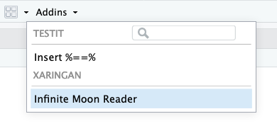

```{r setup, include=FALSE}
options(htmltools.dir.version = FALSE, width = 70)

knitr::opts_chunk$set(
  fig.width=9, fig.height=3.5, fig.retina=3,
  out.width = "100%",
  cache = FALSE,
  echo = TRUE,
  message = FALSE,
  warning = FALSE,
  fig.show = TRUE,
  hiline = TRUE
)
```

name: title
class: bottom hide-count

```{r xaringan-extras, echo=FALSE, results="asis"}
xaringanExtra::use_xaringan_extra(c(
  "tile_view",
  "tachyons"
))
xaringanExtra::use_webcam(width = 300, height = 225)
xaringanExtra::use_extra_styles(hover_code_line = FALSE, mute_unhighlighted_code = TRUE)
```

```{r iframe_placeholder, include=FALSE}
iframe_fullscreen <- function(path, scale = 1, placeholder_text = "iframe content") {
  scale <- as.numeric(scale)
  scale <- switch(
    sprintf("%1.2f", scale),
    "1.25" = "-scale-125",
    "1.50" = "-scale-150",
    "2.00" = "-scale-200",
    ""
  )
  iframe <- if (isTRUE(getOption("iframe_placeholder", FALSE))) {
    glue::glue('content from <a href="{path}">{path}</a> here')
  } else {
    glue::glue(
      '<div data-iframe data-src="{path}" class="fullscreen-iframe{scale}">
       <a href="{path}">{placeholder_text}</a>
    </div>'
    )
  }
  glue::glue(
    '<div class="fullscreen-iframe-container">{iframe}</div>'
  )
}
```

<!-- Title Slide -->
.talk-meta[
.talk-title.center[
# .f-carter[`r rmarkdown::metadata$title`]

## .pink.f-pompiere[`r rmarkdown::metadata$subtitle`]
]

<div class="talk-author f-zilla">`r paste(rmarkdown::metadata$author, collapse = " &middot; ")`</div>
<div class="talk-twitter code">&commat;grrrck</div>
<div class="talk-date code">`r paste(rmarkdown::metadata$date, collapse = ", ")`</div>
]

---
background-image: url(assets/img/umbrella-card.jpg)
background-size: 437px 681px
background-position: left center
background-repeat: no-repeat
class: about-xaringan


# xaringan

<div class="f3 code mv0">
install.packages("xaringan")
</div>

--

1. Write in R Markdown+

--
2. Render slides &rarr; web pages

--
3. Style with CSS

---
exclude: true
background-image: url('https://source.unsplash.com/guzobeWoOAo/1600x900')
background-size: cover
background-position: center center
background-repeat: no-repeat
class: white center middle

.f1[
# .white.f-carter[What is xaringan?]
]

.f2.code[
install.packages("xaringan")
]

---

# CSS Classes and Rules

.pull-left[
### CSS Styles

<pre id="css-classes-rules-code" class="css-editable" contenteditable="true" autocorrect="off" autocomplete="off" spellcheck="false"><code style="font-size: 1.1em">
</code></pre>
]

.pull-right[
### Markdown

<pre><code style="font-size: 1.1em">.compliment&#8203;[
.rstudio-blue&#8203;[RStudio] is cool.
]
</code></pre>

.mt5[
### HTML

<p class="compliment"><span class="rstudio-blue">RStudio</span> is cool</p>
]
]

<style id="css-classes-rules">
.compliment {
  font-size: 2em;
}

.rstudio-blue {
  color: #4d8dc9;
}
</style>

---
name: web-nutshell
class: middle

.pull-left.tc[
# The Web in a Nutshell

<h1 class="green"><em>Everything</em><br/>is in a box</h1>
]

<div class="code pull-right mv4">.compliment&#8203;[<br>
&nbsp;&nbsp;<span>.rstudio-blue&#8203;[RStudio]</span> is cool.<br>
]
</div>

<div class="pull-right f4">
There are .b[two types] of box:<br>
.block.bb.pointer[block boxes] and .inline.bb.pointer[inline boxes].
</div>

---
class: middle

.center[
# Infinite Moon Reader


]

---
class: rstudio-slide hide-count
background-image: url(assets/img/rstudio-project-demo.png)
background-size: cover

<!--

To include an RStudio IDE embedded in the slides, add the following as inline R code

iframe_fullscreen("http://localhost:8765", placeholder_text = "Embedded RStudio IDE...")

You also need to be running the docker container from the ./docker/ folder

cd ./docker
docker build -t grrrck/xaringan-playground .
docker run -d --rm -p 8765:8787 -e DISABLE_AUTH="true" --name xp grrrck/xaringan-playground

Then use xaringan::inf_mr() or js4shiny::live_preview() to serve the slides.

-->
